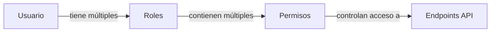

## Información General

El sistema de permisos de Fabrica Marie ERP utiliza un modelo basado en roles (RBAC - Role-Based Access Control). Los permisos se asignan a roles, y los roles se asignan a usuarios. Un usuario puede tener múltiples roles y heredará todos los permisos de cada rol asignado.

### Arquitectura de Permisos



## Modelo de Datos

### Permiso

Los permisos son las unidades más granulares de control de acceso en el sistema.

<ResponseField name="id" type="integer">
  Identificador único del permiso
</ResponseField>

<ResponseField name="codigo" type="string">
  Código único del permiso. Debe ser descriptivo y seguir la convención: `accion_recurso` (ej: `ver_roles`, `crear_venta`, `eliminar_producto`)
</ResponseField>

<ResponseField name="descripcion" type="string">
  Descripción legible del permiso que explica qué acción autoriza
</ResponseField>

### Ejemplo de Estructura

```json
{
  "id": 15,
  "codigo": "editar_venta",
  "descripcion": "Permite editar ventas existentes"
}
```

---

## Uso de Permisos en API

### Middleware de Permisos

Los endpoints de la API pueden protegerse con el middleware `permiso` que verifica si el usuario autenticado tiene el permiso requerido.

<CodeGroup>
```php Ejemplo en Rutas
Route::post('/ventas', [VentaController::class, 'store'])
    ->middleware(['auth:sanctum', 'caja.abierta']);

Route::put('/ventas/{id}', [VentaController::class, 'update'])
    ->middleware(['auth:sanctum', 'permiso:editar_venta']);

Route::delete('/ventas/{id}', [VentaController::class, 'destroy'])
    ->middleware(['auth:sanctum', 'permiso:eliminar_venta']);
```

```php Verificación en Controlador
class VentaController extends Controller
{
    public function update(Request $request, $id)
    {
        // El middleware ya verificó el permiso 'editar_venta'
        // Proceder con la lógica de actualización
        $venta = Venta::findOrFail($id);
        // ...
    }
}
```

```php Verificación Manual
// En cualquier parte del código
if ($user->hasPermiso('editar_venta')) {
    // Usuario tiene el permiso
    // Ejecutar acción
}
```
</CodeGroup>

### Response de Error

Cuando un usuario intenta acceder a un endpoint sin el permiso necesario:

```json Error 403 - Sin Permiso
{
  "message": "No tienes permiso para realizar esta acción",
  "required_permission": "editar_venta"
}
```

---

## Catálogo de Permisos

### Permisos de Administración

| Código | Descripción | Roles Típicos |
|--------|-------------|---------------|
| `ver_roles` | Ver listado y detalle de roles | ADMIN |
| `crear_rol` | Crear nuevos roles | ADMIN |
| `editar_rol` | Editar roles existentes y cambiar su estado | ADMIN |
| `asignar_permisos` | Asignar permisos a roles | ADMIN |
| `ver_usuarios` | Ver listado de usuarios del sistema | ADMIN, GERENTE |
| `crear_usuario` | Crear nuevos usuarios | ADMIN |
| `editar_usuario` | Editar información de usuarios | ADMIN |

### Permisos de Ventas

| Código | Descripción | Roles Típicos |
|--------|-------------|---------------|
| `ver_ventas` | Ver listado de ventas | ADMIN, GERENTE, CAJERO, VENDEDOR |
| `crear_venta` | Registrar nuevas ventas | VENDEDOR, CAJERO |
| `editar_venta` | Modificar ventas existentes | ADMIN, GERENTE |
| `eliminar_venta` | Eliminar o anular ventas | ADMIN, GERENTE |
| `ver_reporte_ventas` | Acceder a reportes de ventas | ADMIN, GERENTE, SUPERVISOR |

### Permisos de Inventario

| Código | Descripción | Roles Típicos |
|--------|-------------|---------------|
| `ver_inventario` | Ver stock y productos | ADMIN, ALMACENERO, VENDEDOR |
| `crear_producto` | Crear nuevos productos | ADMIN, ALMACENERO |
| `editar_producto` | Modificar productos existentes | ADMIN, ALMACENERO |
| `eliminar_producto` | Eliminar productos | ADMIN |
| `ver_movimientos` | Ver movimientos de stock | ADMIN, ALMACENERO, GERENTE |
| `crear_movimiento` | Registrar movimientos de stock | ADMIN, ALMACENERO |
| `eliminar_movimiento` | Eliminar movimientos de stock | ADMIN |
| `ver_kardex` | Ver kardex de productos | ADMIN, ALMACENERO, GERENTE |

### Permisos de Caja

| Código | Descripción | Roles Típicos |
|--------|-------------|---------------|
| `abrir_caja` | Abrir caja al inicio del día | CAJERO |
| `cerrar_caja` | Cerrar caja y generar arqueo | CAJERO, ADMIN |
| `ver_reporte_caja` | Ver reportes y arqueos de caja | ADMIN, GERENTE, CAJERO |
| `crear_movimiento_caja` | Registrar ingresos/egresos en caja | CAJERO |

### Permisos de Clientes

| Código | Descripción | Roles Típicos |
|--------|-------------|---------------|
| `ver_clientes` | Ver listado de clientes | ADMIN, VENDEDOR, FIDELIZACION |
| `crear_cliente` | Registrar nuevos clientes | VENDEDOR, FIDELIZACION |
| `editar_cliente` | Modificar información de clientes | VENDEDOR, FIDELIZACION |
| `eliminar_cliente` | Eliminar clientes | ADMIN |

### Permisos de Vehículos

| Código | Descripción | Roles Típicos |
|--------|-------------|---------------|
| `ver_vehiculos` | Ver listado de vehículos | ADMIN, GERENTE, MANTENIMIENTO |
| `crear_vehiculo` | Registrar nuevos vehículos | ADMIN, MANTENIMIENTO |
| `editar_vehiculo` | Modificar información de vehículos | ADMIN, MANTENIMIENTO |
| `eliminar_vehiculo` | Eliminar vehículos | ADMIN |
| `asignar_vendedor` | Asignar vehículos a vendedores | ADMIN, GERENTE |

### Permisos de Mantenimiento

| Código | Descripción | Roles Típicos |
|--------|-------------|---------------|
| `ver_mantenimientos` | Ver historial de mantenimientos | ADMIN, GERENTE, MANTENIMIENTO |
| `crear_mantenimiento` | Registrar nuevos mantenimientos | MANTENIMIENTO |
| `editar_mantenimiento` | Modificar mantenimientos | MANTENIMIENTO |
| `eliminar_mantenimiento` | Eliminar registros de mantenimiento | ADMIN |

### Permisos de Abonos

| Código | Descripción | Roles Típicos |
|--------|-------------|---------------|
| `crear_abono` | Registrar abonos de clientes | CAJERO, RRHH |
| `anular_abono` | Anular abonos registrados | ADMIN, GERENTE |

---

## Verificación de Permisos

### Desde el Frontend

Al iniciar sesión, el usuario debe obtener su lista de permisos para controlar la UI:

<CodeGroup>
```javascript Obtener Permisos del Usuario
const response = await fetch('https://api.fabricamarie.com/api/me', {
  headers: {
    'Authorization': `Bearer ${token}`,
    'Accept': 'application/json'
  }
});

const user = await response.json();
const permisos = user.permisos.map(p => p.codigo);

// Guardar en estado global (Redux, Context, etc.)
store.dispatch(setPermisos(permisos));
```

```javascript Verificar Permiso en Componente
import { useSelector } from 'react-redux';

function EditarVentaButton({ ventaId }) {
  const permisos = useSelector(state => state.auth.permisos);
  
  if (!permisos.includes('editar_venta')) {
    return null; // No mostrar botón
  }
  
  return (
    <button onClick={() => editarVenta(ventaId)}>
      Editar Venta
    </button>
  );
}
```

```vue Vue.js con Composable
<script setup>
import { computed } from 'vue';
import { useAuth } from '@/composables/useAuth';

const { hasPermiso } = useAuth();
const canEdit = computed(() => hasPermiso('editar_venta'));
</script>

<template>
  <button v-if="canEdit" @click="editarVenta">
    Editar Venta
  </button>
</template>
```
</CodeGroup>

### Endpoint para Obtener Permisos

El endpoint `/api/me` devuelve el usuario actual con sus roles y permisos:

```json GET /api/me Response
{
  "id": 5,
  "username": "jperez",
  "nombre": "Juan Pérez",
  "email": "jperez@fabricamarie.com",
  "roles": [
    {
      "id": 3,
      "nombre": "VENDEDOR"
    }
  ],
  "permisos": [
    {
      "id": 10,
      "codigo": "ver_ventas",
      "descripcion": "Ver listado de ventas"
    },
    {
      "id": 11,
      "codigo": "crear_venta",
      "descripcion": "Registrar nuevas ventas"
    },
    {
      "id": 15,
      "codigo": "ver_clientes",
      "descripcion": "Ver listado de clientes"
    }
  ]
}
```

---

## Mejores Prácticas

<Card title="Principio de Menor Privilegio" icon="shield-check">
  Asigna solo los permisos estrictamente necesarios para cada rol. Es más seguro agregar permisos según se necesiten que otorgar acceso amplio desde el inicio.
</Card>

<Card title="Convención de Nombres" icon="tag">
  Usa una convención clara para nombrar permisos: `verbo_recurso` (ej: `ver_ventas`, `crear_producto`, `editar_cliente`). Esto facilita la comprensión y mantenimiento.
</Card>

<Card title="Documentación" icon="book">
  Documenta qué hace cada permiso y en qué contextos se usa. Actualiza esta documentación cuando agregues nuevos permisos.
</Card>

<Card title="Validación en Backend" icon="server">
  NUNCA confíes solo en la validación del frontend. Siempre verifica permisos en el backend antes de ejecutar operaciones sensibles.
</Card>

<Card title="Auditoría" icon="clipboard-list">
  Implementa logs de auditoría para acciones críticas que registren quién realizó cada acción y cuándo.
</Card>

---

## Agregar Nuevos Permisos

Para agregar un nuevo permiso al sistema:

### 1. Crear el Permiso en la Base de Datos

```sql
INSERT INTO permisos (codigo, descripcion) 
VALUES ('exportar_reportes', 'Permite exportar reportes a Excel/PDF');
```

### 2. Asignar a Roles

Usa el endpoint de actualización de permisos para asignar el nuevo permiso a los roles correspondientes:

```bash
curl -X PUT \
  'https://api.fabricamarie.com/api/admin/roles/2/permisos' \
  -H 'Authorization: Bearer {token}' \
  -H 'Content-Type: application/json' \
  -d '{
    "permisos": [1, 2, 3, 50]
  }'
```

### 3. Proteger Endpoints

Agrega el middleware de permiso a las rutas que requieran el nuevo permiso:

```php
Route::get('/reportes/export', [ReporteController::class, 'export'])
    ->middleware(['auth:sanctum', 'permiso:exportar_reportes']);
```

### 4. Actualizar Frontend

Implementa la validación en el frontend para mostrar/ocultar elementos según el permiso:

```javascript
if (hasPermiso('exportar_reportes')) {
  // Mostrar botón de exportar
}
```

---

## Solución de Problemas

### Error: "No tienes permiso para realizar esta acción"

**Causa**: El usuario no tiene el permiso requerido asignado a ninguno de sus roles.

**Solución**:
1. Verificar qué permiso requiere el endpoint en `/workspace/source/routes/api.php`
2. Verificar los roles del usuario con `GET /api/admin/usuarios`
3. Verificar los permisos del rol con `GET /api/admin/roles/{id}`
4. Asignar el permiso faltante al rol usando `PUT /api/admin/roles/{id}/permisos`

### Los Permisos no se Actualizan

**Causa**: El usuario puede tener un token cacheado con permisos antiguos.

**Solución**:
1. Cerrar sesión y volver a iniciar sesión para obtener un nuevo token
2. Alternativamente, llamar a `GET /api/me` para obtener los permisos actualizados

### Permiso Asignado pero Sigue sin Acceso

**Causa**: El rol puede estar desactivado.

**Solución**:
1. Verificar el estado del rol con `GET /api/admin/roles/{id}`
2. Si `activo: 0`, activarlo con `PUT /api/admin/roles/{id}/estado`