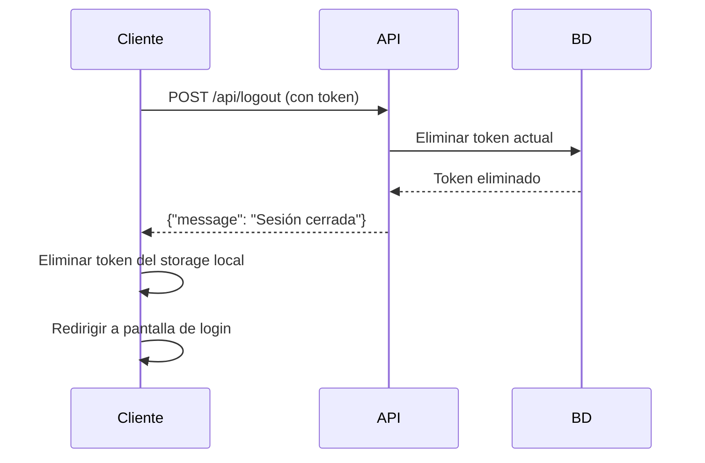

## Descripción

Cierra la sesión del usuario autenticado eliminando el token de acceso actual. Esto invalida el token utilizado en la petición, por lo que no podrá ser usado nuevamente.

<Warning>
**Requiere autenticación:** Este endpoint requiere un token válido de Sanctum en el header `Authorization`.
</Warning>

## Autenticación

```bash
Authorization: Bearer {token}
```

Donde `{token}` es el token obtenido del endpoint `/api/login`.

## Parámetros

Este endpoint no requiere parámetros en el body de la solicitud.

## Respuesta exitosa

<ResponseField name="message" type="string">
  Mensaje de confirmación del cierre de sesión.
  
  **Valor:** `"Sesión cerrada"`
</ResponseField>

## Errores

### Códigos de error comunes

<ResponseExample>
```json 401 - No autenticado
{
  "message": "Unauthenticated."
}
```
</ResponseExample>

<Note>
El código de error 401 se retorna cuando:
- No se proporciona el header `Authorization`
- El token es inválido o ha expirado
- El token ya fue eliminado previamente
</Note>

## Ejemplos de código

<CodeGroup>
```bash cURL
curl -X POST https://api.fabricamarie.com/api/logout \
  -H "Authorization: Bearer 1|a8sdf7a98sd7f98a7sd98f7a98sd7f98a7sd98f7a98sd7f" \
  -H "Accept: application/json"
```

```javascript JavaScript (Fetch)
const token = localStorage.getItem('auth_token');

const response = await fetch('https://api.fabricamarie.com/api/logout', {
  method: 'POST',
  headers: {
    'Authorization': `Bearer ${token}`,
    'Accept': 'application/json'
  }
});

const data = await response.json();

if (response.ok) {
  // Eliminar el token almacenado
  localStorage.removeItem('auth_token');
  console.log('Sesión cerrada exitosamente');
  // Redirigir al login
  window.location.href = '/login';
} else {
  console.error('Error al cerrar sesión:', data.message);
}
```

```php PHP
<?php

use Illuminate\Support\Facades\Http;

$token = 'tu_token_aqui';

$response = Http::withToken($token)
    ->post('https://api.fabricamarie.com/api/logout');

if ($response->successful()) {
    $data = $response->json();
    echo $data['message']; // "Sesión cerrada"
    
    // Limpiar sesión local
    session_destroy();
} else {
    echo "Error: " . $response->status();
}
```

```python Python
import requests

token = 'tu_token_aqui'
url = 'https://api.fabricamarie.com/api/logout'
headers = {
    'Authorization': f'Bearer {token}',
    'Accept': 'application/json'
}

response = requests.post(url, headers=headers)

if response.status_code == 200:
    result = response.json()
    print(result['message'])  # "Sesión cerrada"
else:
    print(f"Error: {response.status_code}")
```
</CodeGroup>

## Respuesta de ejemplo

```json 200 - Cierre de sesión exitoso
{
  "message": "Sesión cerrada"
}
```

## Comportamiento del sistema

<Info>
**¿Qué sucede al hacer logout?**

1. El token de acceso actual se elimina de la base de datos
2. El token ya no será válido para futuras peticiones
3. Los demás tokens del usuario (si inició sesión en otros dispositivos) permanecen activos
4. El usuario debe volver a hacer login para obtener un nuevo token
</Info>

## Flujo recomendado



## Notas adicionales

<Tip>
**Buenas prácticas:**

- Siempre llama a este endpoint antes de eliminar el token del lado del cliente
- Limpia cualquier información sensible del almacenamiento local después del logout
- Redirige al usuario a la pantalla de login inmediatamente
- Maneja correctamente los errores 401 (el token ya podría estar invalidado)
</Tip>

<Warning>
Si un usuario tiene múltiples sesiones activas (diferentes dispositivos), este endpoint solo cierra la sesión del dispositivo actual. Para cerrar todas las sesiones, necesitarías un endpoint adicional que elimine todos los tokens del usuario.
</Warning>