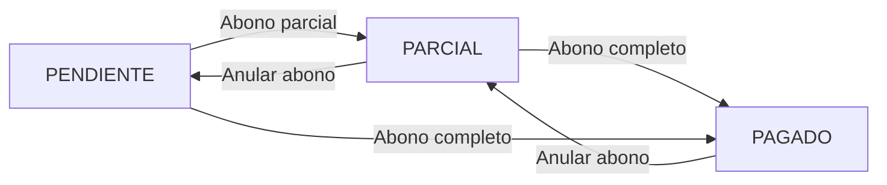

## Registrar Abono

<Note>
  Registra un pago (abono) a una cuenta por cobrar y actualiza el saldo pendiente.
</Note>

### Endpoint

```
POST /api/abonos
```

### Autenticación

<ParamField header="Authorization" type="string" required>
  Token de autenticación Bearer
</ParamField>

### Parámetros del Body

<ParamField body="cuenta_id" type="integer" required>
  ID de la cuenta por cobrar a la que se aplicará el abono
</ParamField>

<ParamField body="caja_id" type="integer" required>
  ID de la caja donde se registrará el ingreso
</ParamField>

<ParamField body="monto" type="number" required>
  Monto del abono a registrar (debe ser mayor a 0)
</ParamField>

<ParamField body="metodo_pago" type="string" required>
  Método de pago utilizado. Ejemplos: EFECTIVO, TRANSFERENCIA, CHEQUE, TARJETA
</ParamField>

### Comportamiento

Al registrar un abono se ejecutan las siguientes acciones en una transacción:

1. **Registra movimiento de caja**:
   - Tipo: INGRESO
   - Se vincula a la caja especificada
   - Fecha: Momento actual

2. **Crea el abono**:
   - Se asocia a la cuenta por cobrar
   - Se vincula al movimiento de caja creado
   - Fecha: Momento actual

3. **Actualiza la cuenta**:
   - Reduce el saldo: `saldo = saldo - monto`
   - Cambia el estado:
     - `PAGADO` si el saldo queda en 0
     - `PARCIAL` si aún queda saldo pendiente

### Respuesta

<ResponseField name="id" type="integer">
  ID único del abono creado
</ResponseField>

<ResponseField name="cuenta_id" type="integer">
  ID de la cuenta por cobrar
</ResponseField>

<ResponseField name="monto" type="number">
  Monto del abono
</ResponseField>

<ResponseField name="metodo_pago" type="string">
  Método de pago utilizado
</ResponseField>

<ResponseField name="fecha" type="string">
  Fecha del abono (formato: Y-m-d H:i:s)
</ResponseField>

<ResponseField name="movimiento_caja_id" type="integer">
  ID del movimiento de caja asociado
</ResponseField>

<CodeGroup>

```json Ejemplo - Abono parcial
{
  "cuenta_id": 450,
  "caja_id": 1,
  "monto": 500.00,
  "metodo_pago": "EFECTIVO"
}
```

```json Ejemplo - Liquidación total
{
  "cuenta_id": 450,
  "caja_id": 1,
  "monto": 1000.00,
  "metodo_pago": "TRANSFERENCIA"
}
```

```bash Solicitud
curl -X POST "https://api.fabricamarie.com/api/abonos" \
  -H "Authorization: Bearer {token}" \
  -H "Content-Type: application/json" \
  -d '{
    "cuenta_id": 450,
    "caja_id": 1,
    "monto": 500.00,
    "metodo_pago": "EFECTIVO"
  }'
```

```json Respuesta 200 OK
{
  "id": 120,
  "cuenta_id": 450,
  "monto": 500.00,
  "metodo_pago": "EFECTIVO",
  "fecha": "2026-03-11 14:30:00",
  "movimiento_caja_id": 1523,
  "created_at": "2026-03-11T14:30:00.000000Z",
  "updated_at": "2026-03-11T14:30:00.000000Z"
}
```

```json Error 404 - Cuenta no encontrada
{
  "message": "No query results for model [App\\Models\\CuentaPorCobrar] 450"
}
```

</CodeGroup>

---

## Anular Abono

<Warning>
  Anula un abono registrado, revirtiendo el movimiento de caja y restaurando el saldo de la cuenta.
</Warning>

### Endpoint

```
POST /api/abonos/{id}/anular
```

### Autenticación

<ParamField header="Authorization" type="string" required>
  Token de autenticación Bearer
</ParamField>

### Parámetros de Ruta

<ParamField path="id" type="integer" required>
  ID del abono a anular
</ParamField>

### Comportamiento

La anulación es manejada por el AbonoService y ejecuta:

1. **Revierte el movimiento de caja**:
   - Marca el ingreso como anulado
   - Registra el usuario que anula

2. **Restaura el saldo de la cuenta**:
   - Suma el monto del abono al saldo actual
   - Actualiza el estado de la cuenta:
     - De `PAGADO` a `PARCIAL` o `PENDIENTE`

3. **Marca el abono como anulado**:
   - Registra fecha y usuario de anulación

### Respuesta

<ResponseField name="message" type="string">
  Mensaje de confirmación
</ResponseField>

<ResponseField name="abono_id" type="integer">
  ID del abono anulado
</ResponseField>

<CodeGroup>

```bash Solicitud
curl -X POST "https://api.fabricamarie.com/api/abonos/120/anular" \
  -H "Authorization: Bearer {token}"
```

```json Respuesta 200 OK
{
  "message": "Abono anulado correctamente",
  "abono_id": 120
}
```

```json Error 404 - Abono no encontrado
{
  "message": "No query results for model [App\\Models\\Abono] 120"
}
```

```json Error 500 - Ya anulado
{
  "message": "El abono ya ha sido anulado previamente"
}
```

</CodeGroup>

---

## Estados de Cuentas por Cobrar

<Note>
  Las cuentas por cobrar pueden tener los siguientes estados automáticos.
</Note>

### Estados Disponibles

<ResponseField name="PENDIENTE" type="string">
  La cuenta tiene saldo completo sin ningún abono registrado
</ResponseField>

<ResponseField name="PARCIAL" type="string">
  La cuenta ha recibido uno o más abonos pero aún tiene saldo pendiente
</ResponseField>

<ResponseField name="PAGADO" type="string">
  La cuenta ha sido liquidada completamente (saldo = 0)
</ResponseField>

### Transiciones de Estado



---

## Consultar Cuentas por Cobrar

<Note>
  Las cuentas por cobrar se pueden consultar a través del endpoint de detalles de venta.
</Note>

### Obtener cuenta de una venta

```
GET /api/ventas/{id}
```

La respuesta incluye el objeto `cuenta` con:
- Monto total
- Saldo actual
- Estado
- Lista de abonos realizados

<CodeGroup>

```bash Consultar venta con cuenta
curl -X GET "https://api.fabricamarie.com/api/ventas/1523" \
  -H "Authorization: Bearer {token}"
```

```json Respuesta - Cuenta con abonos
{
  "venta": {
    "id": 1523,
    "codigo": "VTA-001523",
    "tipo_pago": "CREDITO",
    "total_neto": 1500.00,
    "adelanto": 500.00,
    "cuenta": {
      "id": 450,
      "cliente_id": 45,
      "monto_total": 1500.00,
      "saldo": 500.00,
      "estado": "PARCIAL",
      "abonos": [
        {
          "id": 120,
          "monto": 500.00,
          "metodo_pago": "EFECTIVO",
          "fecha": "2026-03-11 14:30:00",
          "movimiento_caja_id": 1523
        }
      ]
    }
  }
}
```

</CodeGroup>

---

## Flujo Completo: Venta a Crédito con Abonos

### 1. Crear venta a crédito

```json
POST /api/ventas
{
  "cliente_id": 45,
  "vendedor_id": 12,
  "tipo_pago": "CREDITO",
  "adelanto": 500.00,
  "total_neto": 1500.00,
  "items": [...]
}
```

**Resultado**: Se crea automáticamente una cuenta por cobrar con:
- `monto_total`: 1500.00
- `saldo`: 1000.00 (1500 - 500 adelanto)
- `estado`: PENDIENTE

### 2. Confirmar la venta

```bash
POST /api/ventas/{id}/confirmar
```

**Resultado**: 
- Descuenta stock
- Registra ingreso de caja por el adelanto (500.00)
- Estado venta: CONFIRMADA

### 3. Registrar primer abono

```json
POST /api/abonos
{
  "cuenta_id": 450,
  "caja_id": 1,
  "monto": 300.00,
  "metodo_pago": "TRANSFERENCIA"
}
```

**Resultado**: 
- `saldo`: 700.00 (1000 - 300)
- `estado`: PARCIAL

### 4. Registrar segundo abono (liquidación)

```json
POST /api/abonos
{
  "cuenta_id": 450,
  "caja_id": 1,
  "monto": 700.00,
  "metodo_pago": "EFECTIVO"
}
```

**Resultado**: 
- `saldo`: 0.00
- `estado`: PAGADO

---

## Métodos de Pago Comunes

<ResponseField name="EFECTIVO" type="string">
  Pago en efectivo
</ResponseField>

<ResponseField name="TRANSFERENCIA" type="string">
  Transferencia bancaria
</ResponseField>

<ResponseField name="CHEQUE" type="string">
  Pago con cheque
</ResponseField>

<ResponseField name="TARJETA" type="string">
  Pago con tarjeta de crédito/débito
</ResponseField>

<ResponseField name="DEPOSITO" type="string">
  Depósito bancario
</ResponseField>

---

## Consideraciones Importantes

<Warning>
  **Validaciones de negocio**
  
  - No se puede abonar más del saldo pendiente
  - El monto debe ser mayor a 0
  - La cuenta debe existir y estar activa
  - Solo se pueden anular abonos no anulados previamente
</Warning>

<Note>
  **Integridad transaccional**
  
  - Todas las operaciones se ejecutan dentro de transacciones de base de datos
  - Si falla cualquier paso, se revierte toda la operación
  - Los movimientos de caja siempre quedan sincronizados con los abonos
</Note>

## Endpoints Relacionados

- [Crear Venta](/api/sales/create-sale) - Crear ventas a crédito
- [Detalles de Venta](/api/sales/sale-details) - Consultar cuenta por cobrar de una venta
- [Gestión de Clientes](/api/clients/manage-clients) - Información de clientes con crédito