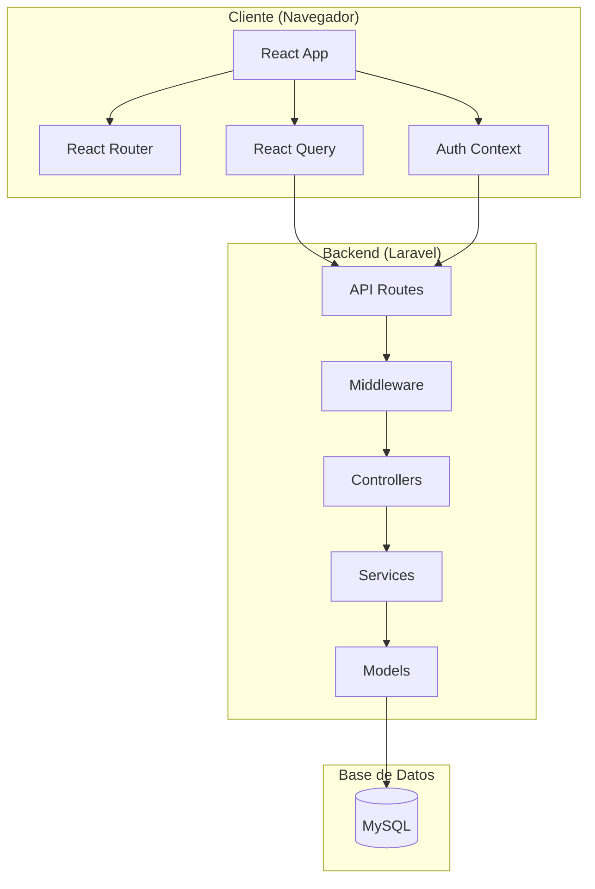
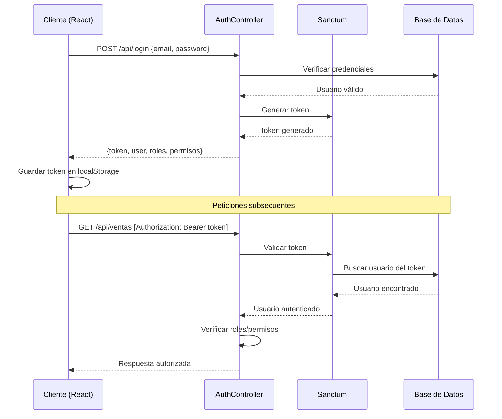
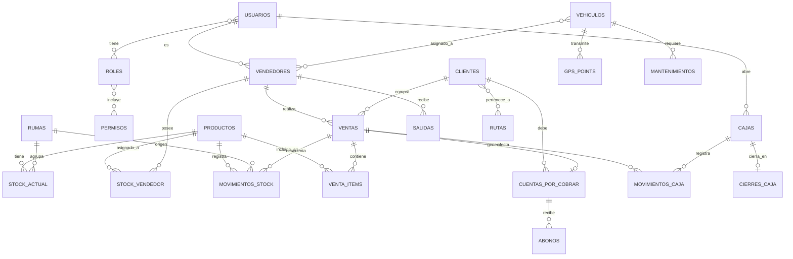

# Arquitectura Técnica

El sistema Fabrica Marie ERP está construido siguiendo principios de arquitectura moderna, separación de responsabilidades y mejores prácticas de desarrollo.

## Visión General

<Frame>

</Frame>

## Arquitectura del Backend

### Stack Tecnológico

<CodeGroup>
```json Dependencias Principales
{
  "php": "^8.2",
  "laravel/framework": "^11.9",
  "laravel/sanctum": "^4.0",
  "laravel/tinker": "^2.9"
}
```
</CodeGroup>

El backend utiliza **Laravel 11** con arquitectura MVC extendida con una capa de servicios.

### Estructura de Carpetas

```
app/
├── Http/
│   ├── Controllers/
│   │   └── Api/           # Controladores de API REST
│   │       ├── AuthController.php
│   │       ├── VentaController.php
│   │       ├── CajaController.php
│   │       ├── ProductoController.php
│   │       └── ...
│   └── Middleware/
│       ├── CheckRole.php       # Validación de roles
│       ├── CheckPermiso.php    # Validación de permisos
│       └── CajaAbierta.php     # Validación de caja abierta
├── Models/               # Modelos Eloquent
│   ├── Usuario.php
│   ├── Venta.php
│   ├── Producto.php
│   ├── Caja.php
│   ├── Cliente.php
│   └── ...
├── Services/            # Lógica de negocio
│   ├── VentaService.php
│   ├── CajaService.php
│   ├── StockService.php
│   └── ...
config/
├── sanctum.php          # Configuración de autenticación
└── database.php
routes/
└── api.php              # Definición de rutas API
```

### Capa de Controladores

Los controladores manejan las peticiones HTTP y delegan la lógica de negocio a los servicios:

<CodeGroup>
```php VentaController.php
<?php

namespace App\Http\Controllers\Api;

use App\Models\Venta;
use Illuminate\Http\Request;
use Illuminate\Support\Facades\DB;
use App\Services\VentaService;

class VentaController extends Controller
{
    // Listar ventas con filtros
    public function index()
    {
        return $this->buildReporteQuery(request())->get();
    }

    // Crear venta (estado BORRADOR)
    public function store(Request $request)
    {
        $validated = $request->validate([
            'cliente_id' => 'required|exists:clientes,id',
            'vendedor_id' => 'required|exists:vendedores,id',
            'tipo_pago' => 'required|in:CONTADO,CREDITO',
            'total_neto' => 'required|numeric|min:0',
            'items' => 'required|array|min:1',
        ]);

        return DB::transaction(function () use ($validated) {
            // Lógica de creación de venta
            // Ver línea 198 en el archivo fuente
        });
    }

    // Confirmar venta (cambiar de BORRADOR a CONFIRMADA)
    public function confirmar($id, StockService $stockService)
    {
        return DB::transaction(function () use ($id) {
            // Descontar stock, registrar en caja, cambiar estado
            // Ver línea 264 en el archivo fuente
        });
    }

    // Anular venta (solo CONFIRMADAS)
    public function anular($id, VentaService $service)
    {
        return $service->anular($id, auth()->id());
    }
}
```

```php AuthController.php
<?php

namespace App\Http\Controllers\Api;

use Illuminate\Http\Request;
use Illuminate\Support\Facades\Auth;

class AuthController extends Controller
{
    public function login(Request $request)
    {
        $credentials = $request->validate([
            'email' => 'required|email',
            'password' => 'required'
        ]);

        // Intentar autenticar (solo usuarios activos)
        if (!Auth::attempt([
            'email' => $credentials['email'],
            'password' => $credentials['password'],
            'activo' => 1
        ])) {
            return response()->json(
                ['message' => 'Credenciales incorrectas'], 
                401
            );
        }

        $user = Auth::user();
        $user->ultimo_login = now();
        $user->save();

        // Generar token Sanctum
        $token = $user->createToken('erp-token')->plainTextToken;

        return response()->json([
            'token' => $token,
            'user' => $user,
            'roles' => $user->roles,
            'permisos' => $user->permisos()->get()
        ]);
    }

    public function logout(Request $request)
    {
        $request->user()->currentAccessToken()->delete();
        return response()->json(['message' => 'Sesión cerrada']);
    }

    public function me(Request $request)
    {
        return response()->json([
            'user' => $request->user(),
            'roles' => $request->user()->roles,
            'permisos' => $request->user()->permisos()->get()
        ]);
    }
}
```
</CodeGroup>

### Capa de Servicios

Los servicios encapsulan lógica de negocio compleja y operaciones transaccionales:

<CodeGroup>
```php VentaService.php
<?php

namespace App\Services;

use App\Models\Venta;
use App\Models\StockVendedor;
use App\Models\MovimientoCaja;
use Illuminate\Support\Facades\DB;
use Exception;

class VentaService
{
    /**
     * Anula una venta confirmada
     * - Devuelve stock al vendedor
     * - Elimina cuenta por cobrar (si no tiene abonos)
     * - Registra egreso en caja
     * - Cambia estado a ANULADA
     */
    public function anular(int $ventaId, int $userId)
    {
        return DB::transaction(function () use ($ventaId, $userId) {
            // Bloquear venta para evitar condiciones de carrera
            $venta = Venta::with(['cuenta'])
                ->lockForUpdate()
                ->findOrFail($ventaId);

            // Validaciones
            if ($venta->estado === 'ANULADA') {
                throw new Exception('La venta ya fue anulada');
            }

            if ($venta->estado !== 'CONFIRMADA') {
                throw new Exception(
                    'Solo se pueden anular ventas confirmadas'
                );
            }

            // 1. Devolver stock al vendedor
            foreach ($venta->items as $item) {
                $stockVendedor = StockVendedor::where(
                    'producto_id', $item->producto_id
                )->where(
                    'vendedor_id', $venta->vendedor_id
                )->first();

                if ($stockVendedor) {
                    $stockVendedor->cantidad += $item->cantidad;
                    $stockVendedor->save();
                }
            }

            // 2. Validar y eliminar cuenta por cobrar
            if ($venta->cuenta) {
                $tieneAbonos = $venta->cuenta
                    ->abonos()
                    ->where('estado', 'ACTIVO')
                    ->exists();

                if ($tieneAbonos) {
                    throw new Exception(
                        'No se puede anular: existen abonos registrados'
                    );
                }

                $venta->cuenta->delete();
            }

            // 3. Registrar egreso en caja
            $caja = request()->get('caja');
            if (!$caja) {
                throw new Exception(
                    'No existe caja abierta para la anulación'
                );
            }

            $montoDevolucion = ($venta->tipo_pago === 'CONTADO')
                ? $venta->total_neto
                : $venta->adelanto;

            MovimientoCaja::create([
                'caja_id' => $caja->id,
                'tipo' => 'EGRESO',
                'monto' => $montoDevolucion,
                'referencia_tipo' => 'ANULACION_VENTA',
                'referencia_id' => $venta->id,
                'categoria' => 'VENTA',
                'descripcion' => 'Venta Anulada, ID: ' . $venta->id,
                'created_at' => now()
            ]);

            // 4. Cambiar estado
            $venta->estado = 'ANULADA';
            $venta->save();

            return [
                'message' => 'Venta anulada correctamente',
                'venta_id' => $venta->id
            ];
        });
    }

    /**
     * Libera stock reservado cuando se elimina venta en borrador
     */
    public function liberarReserva(Venta $venta)
    {
        foreach ($venta->items as $item) {
            $stock = StockVendedor::where(
                'producto_id', $item->producto_id
            )->where(
                'vendedor_id', $venta->vendedor_id
            )->lockForUpdate()->first();

            if (!$stock) continue;

            $stock->stock_reservado -= $item->cantidad;
            if ($stock->stock_reservado < 0) {
                $stock->stock_reservado = 0;
            }
            $stock->save();
        }
    }
}
```

```php CajaService.php
<?php

namespace App\Services;

use App\Models\Caja;
use App\Models\MovimientoCaja;

class CajaService
{
    /**
     * Registra un movimiento en la caja abierta actual
     */
    public static function registrarMovimiento(array $data)
    {
        $caja = Caja::where('fecha', now()->toDateString())
            ->where('estado', 'ABIERTA')
            ->first();

        if (!$caja) {
            throw new \Exception('No hay caja abierta');
        }

        $movimiento = MovimientoCaja::create([
            'caja_id' => $caja->id,
            'tipo' => $data['tipo'],
            'monto' => $data['monto'],
            'categoria' => $data['categoria'],
            'descripcion' => $data['descripcion'],
            'referencia_tipo' => $data['referencia_tipo'] ?? null,
            'referencia_id' => $data['referencia_id'] ?? null,
            'created_at' => now()
        ]);

        // Actualizar saldo actual de caja
        if ($data['tipo'] === 'INGRESO') {
            $caja->saldo_actual += $data['monto'];
            $caja->total_ingresos += $data['monto'];
        } else {
            $caja->saldo_actual -= $data['monto'];
            $caja->total_egresos += $data['monto'];
        }
        $caja->save();

        return $movimiento;
    }

    /**
     * Cierra la caja del día
     */
    public function cerrarCaja($cajaId, array $data)
    {
        $caja = Caja::findOrFail($cajaId);

        if ($caja->estado === 'CERRADA') {
            throw new \Exception('La caja ya está cerrada');
        }

        $saldoEsperado = $caja->saldo_inicial 
            + $caja->total_ingresos 
            - $caja->total_egresos;
        
        $diferencia = $data['efectivo_contado'] - $saldoEsperado;

        // Crear registro de cierre
        $cierre = $caja->cierreCaja()->create([
            'saldo_esperado' => $saldoEsperado,
            'efectivo_contado' => $data['efectivo_contado'],
            'diferencia' => $diferencia,
            'observaciones' => $data['observaciones'] ?? null,
        ]);

        // Actualizar caja
        $caja->estado = 'CERRADA';
        $caja->cerrado_at = now();
        $caja->cerrado_by = auth()->id();
        $caja->save();

        return $cierre;
    }
}
```
</CodeGroup>

### Middleware

El sistema implementa middleware personalizado para control de acceso:

<CodeGroup>
```php CheckRole.php
<?php

namespace App\Http\Middleware;

use Closure;
use Illuminate\Http\Request;

class CheckRole
{
    /**
     * Verifica que el usuario tenga alguno de los roles permitidos
     * 
     * Uso en routes/api.php:
     * Route::middleware('role:ADMIN,GERENTE')->group(...)
     */
    public function handle(
        Request $request, 
        Closure $next, 
        ...$roles
    )
    {
        $user = auth()->user();

        if (!$user) {
            return response()->json(
                ['error' => 'No autenticado'], 
                401
            );
        }

        // Verificar si el usuario tiene alguno de los roles
        if (!$user->roles()->whereIn('nombre', $roles)->exists()) {
            return response()->json(
                ['error' => 'No autorizado'], 
                403
            );
        }

        return $next($request);
    }
}
```

```php CajaAbierta.php
<?php

namespace App\Http\Middleware;

use App\Models\Caja;
use Closure;
use Illuminate\Http\Request;

class CajaAbierta
{
    /**
     * Verifica que exista una caja abierta antes de permitir
     * operaciones que afecten el flujo de caja
     * 
     * Aplica a: ventas, abonos, viáticos
     */
    public function handle(Request $request, Closure $next)
    {
        $caja = Caja::where('fecha', now()->toDateString())
            ->where('estado', 'ABIERTA')
            ->first();

        if (!$caja) {
            return response()->json([
                'message' => 'No existe una caja abierta'
            ], 403);
        }

        // Pasar caja al request para uso posterior
        $request->attributes->set('caja', $caja);

        return $next($request);
    }
}
```
</CodeGroup>

### Rutas API

Las rutas están organizadas por módulos con protección de autenticación y roles:

<CodeGroup>
```php routes/api.php
<?php

use Illuminate\Support\Facades\Route;
use App\Http\Controllers\Api\*;

// Ruta pública de login
Route::post('/login', [AuthController::class, 'login']);

// Rutas autenticadas con Sanctum
Route::middleware('auth:sanctum')->group(function () {

    // Sesión
    Route::post('/logout', [AuthController::class, 'logout']);
    Route::get('/me', [AuthController::class, 'me']);

    // Inventario (ADMIN, ALMACENERO, VENDEDOR, GERENTE)
    Route::prefix('inventario')
        ->middleware('role:ADMIN,ALMACENERO,VENDEDOR,GERENTE')
        ->group(function () {
            Route::get('/productos', [ProductoController::class, 'index']);
            Route::post('/productos', [ProductoController::class, 'store']);
            Route::get('/stock', [StockController::class, 'index']);
            Route::post('/salidas', [SalidaController::class, 'store']);
            // ... más rutas
        });

    // Ventas (ADMIN, GERENTE, SUPERVISOR, ALMACENERO, VENDEDOR, CAJERO)
    Route::prefix('ventas')
        ->middleware('role:ADMIN,GERENTE,SUPERVISOR,ALMACENERO,VENDEDOR,CAJERO')
        ->group(function () {
            Route::get('/', [VentaController::class, 'index']);
            
            // Crear venta (requiere caja abierta)
            Route::post('/', [VentaController::class, 'store'])
                ->middleware(['caja.abierta']);
            
            // Anular venta (requiere permiso y caja abierta)
            Route::post('/{id}/anular', [VentaController::class, 'anular'])
                ->middleware(['permiso:eliminar_venta', 'caja.abierta']);
            
            Route::post('/{id}/confirmar', [VentaController::class, 'confirmar']);
        });

    // Caja (ADMIN, GERENTE, CAJERO)
    Route::prefix('caja')
        ->middleware('role:ADMIN,GERENTE,CAJERO')
        ->group(function () {
            Route::get('/', [CajaController::class, 'getCaja']);
            Route::post('/abrir', [CajaController::class, 'abrir']);
            
            // Cerrar caja (requiere permiso)
            Route::post('/{id}/cerrar', [CajaController::class, 'cerrar'])
                ->middleware('permiso:cerrar_caja');
            
            Route::get('/{id}/reporte', [CajaController::class, 'reporte'])
                ->middleware('permiso:ver_reporte_caja');
        });

    // Administración (solo ADMIN)
    Route::prefix('admin')
        ->middleware('role:ADMIN')
        ->group(function () {
            Route::get('/usuarios', [UsuarioController::class, 'index']);
            Route::post('/usuarios', [UsuarioController::class, 'store']);
            Route::get('/roles', [RolController::class, 'index'])
                ->middleware('permiso:ver_roles');
        });

    // ... más grupos de rutas
});
```
</CodeGroup>

### Modelos Eloquent

Los modelos representan las entidades del dominio con relaciones definidas:

<CodeGroup>
```php Usuario.php
<?php

namespace App\Models;

use Illuminate\Foundation\Auth\User as Authenticatable;
use Laravel\Sanctum\HasApiTokens;

class Usuario extends Authenticatable
{
    use HasApiTokens;

    protected $table = 'usuarios';

    protected $fillable = [
        'username', 'email', 'password_hash', 'nombre', 'activo'
    ];

    protected $hidden = ['password_hash'];

    // Laravel espera "password"
    public function getAuthPassword()
    {
        return $this->password_hash;
    }

    // Relaciones
    public function roles()
    {
        return $this->belongsToMany(Rol::class, 'usuario_rol');
    }

    public function permisos()
    {
        return $this->roles()
            ->join('rol_permiso', 'roles.id', '=', 'rol_permiso.rol_id')
            ->join('permisos', 'rol_permiso.permiso_id', '=', 'permisos.id')
            ->select('permisos.*')
            ->distinct();
    }
}
```

```php Venta.php
<?php

namespace App\Models;

use Illuminate\Database\Eloquent\Model;

class Venta extends Model
{
    protected $table = 'ventas';
    public $timestamps = false;

    protected $fillable = [
        'codigo', 'vendedor_id', 'cliente_id', 'fecha',
        'total_neto', 'tipo_pago', 'adelanto', 'descuento', 'estado'
    ];

    public function vendedor()
    {
        return $this->belongsTo(Vendedor::class);
    }

    public function cliente()
    {
        return $this->belongsTo(Cliente::class);
    }

    public function items()
    {
        return $this->hasMany(VentaItem::class);
    }

    public function cuenta()
    {
        return $this->hasOne(CuentaPorCobrar::class);
    }

    public function movimientosStock()
    {
        return $this->hasMany(MovimientoStock::class, 'referencia_id')
            ->where('referencia_tipo', 'VENTA');
    }

    public function movimientosCaja()
    {
        return $this->hasMany(MovimientoCaja::class, 'referencia_id')
            ->where('referencia_tipo', 'VENTA');
    }
}
```

```php Producto.php
<?php

namespace App\Models;

use Illuminate\Database\Eloquent\Model;

class Producto extends Model
{
    protected $table = 'productos';
    public $timestamps = false;

    protected $fillable = [
        'sku', 'categoria', 'nombre', 'descripcion',
        'precio_base', 'costo', 'stock_minimo', 'activo'
    ];

    public function stock()
    {
        return $this->hasMany(StockActual::class, 'producto_id');
    }

    public function stockVendedor()
    {
        return $this->hasMany(StockVendedor::class, 'producto_id');
    }

    public function movimientos()
    {
        return $this->hasMany(MovimientoStock::class, 'producto_id');
    }
}
```
</CodeGroup>

## Autenticación con Laravel Sanctum

### Flujo de Autenticación

<Frame>

</Frame>

### Configuración

<CodeGroup>
```php config/sanctum.php
return [
    'stateful' => explode(',', env(
        'SANCTUM_STATEFUL_DOMAINS',
        'localhost,localhost:3000,127.0.0.1'
    )),
    
    'guard' => ['web'],
    
    'expiration' => null, // Tokens no expiran
    
    'middleware' => [
        'verify_csrf_token' => App\Http\Middleware\VerifyCsrfToken::class,
        'encrypt_cookies' => App\Http\Middleware\EncryptCookies::class,
    ],
];
```
</CodeGroup>

## Arquitectura del Frontend

### Stack Tecnológico

<CodeGroup>
```json package.json
{
  "dependencies": {
    "react": "^19.2.3",
    "react-dom": "^19.2.3",
    "react-router-dom": "^6.30.1",
    "@tanstack/react-query": "^5.83.0",
    "axios": "^1.13.5",
    "typescript": "^5.8.3",
    "vite": "^5.4.19",
    "tailwindcss": "^3.4.17"
  }
}
```
</CodeGroup>

### Estructura de Carpetas

```
resources/js/src/
├── components/
│   ├── ui/              # Componentes de shadcn/ui
│   ├── layout/          # Layout components (Sidebar, Header)
│   ├── auth/            # Login component
│   ├── sales/           # Componentes de ventas
│   └── ...
├── contexts/
│   ├── AuthContext.tsx  # Estado global de autenticación
│   └── RoleContext.tsx  # Gestión de roles
├── pages/
│   ├── Dashboard.tsx
│   ├── sales/
│   │   ├── NewSale.tsx
│   │   ├── SalesHistory.tsx
│   │   └── ...
│   ├── stock/
│   ├── cash/
│   └── ...
├── services/
│   └── api.ts           # Cliente HTTP con Axios
├── App.tsx              # Enrutamiento principal
└── main.tsx             # Punto de entrada
```

### Contexto de Autenticación

<CodeGroup>
```tsx AuthContext.tsx
import React, { createContext, useState, useContext } from 'react';
import { authService } from '@/services/api';

interface User {
    id: number;
    username: string;
    email: string;
    nombre: string;
    roles: any[];
}

interface AuthContextType {
    user: User | null;
    roles: any[];
    permisos: any[];
    loading: boolean;
    login: (email: string, password: string) => Promise<any>;
    logout: () => Promise<any>;
    hasPermission: (permisoCodigo: string) => boolean;
    hasRole: (rolNombre: string) => boolean;
    isAuthenticated: () => boolean;
}

const AuthContext = createContext<AuthContextType | undefined>(undefined);

export const useAuth = () => {
    const context = useContext(AuthContext);
    if (!context) {
        throw new Error('useAuth debe usarse dentro de AuthProvider');
    }
    return context;
};

export const AuthProvider: React.FC<{ children: React.ReactNode }> = 
({ children }) => {
    const [user, setUser] = useState<User | null>(null);
    const [roles, setRoles] = useState<any[]>([]);
    const [permisos, setPermisos] = useState<any[]>([]);
    const [loading, setLoading] = useState(true);

    // Verificar autenticación al cargar
    useEffect(() => {
        const storedUser = localStorage.getItem('user_data');
        if (storedUser) {
            const userData = JSON.parse(storedUser);
            setUser(userData.user);
            setRoles(userData.roles || []);
            setPermisos(userData.permisos || []);
        }
        setLoading(false);
    }, []);

    const login = async (email: string, password: string) => {
        setLoading(true);
        try {
            const response = await authService.login({ email, password });
            
            // Guardar token y datos
            localStorage.setItem('auth_token', response.token);
            localStorage.setItem('user_data', JSON.stringify({
                user: response.user,
                roles: response.roles,
                permisos: response.permisos
            }));
            
            setUser(response.user);
            setRoles(response.roles);
            setPermisos(response.permisos);
            
            return { success: true };
        } catch (err: any) {
            return { success: false, error: err.message };
        } finally {
            setLoading(false);
        }
    };

    const logout = async () => {
        try {
            await authService.logout();
        } finally {
            localStorage.removeItem('auth_token');
            localStorage.removeItem('user_data');
            setUser(null);
            setRoles([]);
            setPermisos([]);
        }
        return { success: true };
    };

    const hasPermission = (permisoCodigo: string) => {
        return permisos.some(p => p.codigo === permisoCodigo);
    };

    const hasRole = (rolNombre: string) => {
        return roles.some(r => r.nombre === rolNombre);
    };

    const isAuthenticated = () => {
        return !!localStorage.getItem('auth_token');
    };

    return (
        <AuthContext.Provider value={{
            user, roles, permisos, loading,
            login, logout, hasPermission, hasRole, isAuthenticated
        }}>
            {children}
        </AuthContext.Provider>
    );
};
```
</CodeGroup>

### Enrutamiento

<CodeGroup>
```tsx App.tsx
import { BrowserRouter, Routes, Route, Navigate } from 'react-router-dom';
import { AuthProvider, useAuth } from '@/contexts/AuthContext';
import { MainLayout } from '@/components/layout/MainLayout';
import Login from '@/components/auth/login';
import Dashboard from '@/pages/Dashboard';
// ... más imports

// Componente para proteger rutas
const ProtectedRoute = ({ children }: { children: JSX.Element }) => {
    const { isAuthenticated, loading } = useAuth();
    
    if (loading) {
        return <div>Cargando...</div>;
    }
    
    if (!isAuthenticated()) {
        return <Navigate to="/login" replace />;
    }
    
    return children;
};

const App = () => (
    <AuthProvider>
        <BrowserRouter>
            <Routes>
                <Route path="/login" element={<Login />} />
                
                <Route element={
                    <ProtectedRoute>
                        <MainLayout />
                    </ProtectedRoute>
                }>
                    <Route path="/dashboard" element={<Dashboard />} />
                    <Route path="/ventas/nueva" element={<NewSale />} />
                    <Route path="/almacen/stock" element={<StockList />} />
                    {/* ... más rutas */}
                </Route>
            </Routes>
        </BrowserRouter>
    </AuthProvider>
);

export default App;
```
</CodeGroup>

## Diseño de Base de Datos

### Diagrama de Entidades Principales

<Frame>

</Frame>

### Tablas Principales

<AccordionGroup>
  <Accordion title="usuarios - Usuarios del Sistema">
    ```sql
    CREATE TABLE usuarios (
        id INT PRIMARY KEY AUTO_INCREMENT,
        username VARCHAR(50) UNIQUE NOT NULL,
        email VARCHAR(100) UNIQUE NOT NULL,
        password_hash VARCHAR(255) NOT NULL,
        nombre VARCHAR(100) NOT NULL,
        activo TINYINT(1) DEFAULT 1,
        ultimo_login DATETIME,
        created_at TIMESTAMP DEFAULT CURRENT_TIMESTAMP
    );
    ```
    
    **Relaciones**:
    - `usuario_rol` (muchos a muchos con `roles`)
    - `vendedores.usuario_id` (uno a uno)
    - `cajas.usuario_id` (uno a muchos)
  </Accordion>

  <Accordion title="roles y permisos - Control de Acceso">
    ```sql
    CREATE TABLE roles (
        id INT PRIMARY KEY AUTO_INCREMENT,
        nombre VARCHAR(50) UNIQUE NOT NULL, -- ADMIN, VENDEDOR, etc.
        descripcion TEXT,
        activo TINYINT(1) DEFAULT 1
    );
    
    CREATE TABLE permisos (
        id INT PRIMARY KEY AUTO_INCREMENT,
        codigo VARCHAR(50) UNIQUE NOT NULL, -- ver_roles, cerrar_caja, etc.
        nombre VARCHAR(100) NOT NULL,
        descripcion TEXT
    );
    
    CREATE TABLE rol_permiso (
        rol_id INT,
        permiso_id INT,
        PRIMARY KEY (rol_id, permiso_id),
        FOREIGN KEY (rol_id) REFERENCES roles(id),
        FOREIGN KEY (permiso_id) REFERENCES permisos(id)
    );
    
    CREATE TABLE usuario_rol (
        usuario_id INT,
        rol_id INT,
        PRIMARY KEY (usuario_id, rol_id),
        FOREIGN KEY (usuario_id) REFERENCES usuarios(id),
        FOREIGN KEY (rol_id) REFERENCES roles(id)
    );
    ```
  </Accordion>

  <Accordion title="productos - Catálogo de Productos">
    ```sql
    CREATE TABLE productos (
        id INT PRIMARY KEY AUTO_INCREMENT,
        sku VARCHAR(50) UNIQUE NOT NULL,
        categoria VARCHAR(50),
        nombre VARCHAR(100) NOT NULL,
        descripcion TEXT,
        presentacion VARCHAR(50),
        marca VARCHAR(50),
        unidad_medida VARCHAR(20),
        peso DECIMAL(10,2),
        precio_base DECIMAL(10,2) NOT NULL,
        costo DECIMAL(10,2) NOT NULL,
        stock_minimo INT DEFAULT 0,
        activo TINYINT(1) DEFAULT 1,
        created_at TIMESTAMP DEFAULT CURRENT_TIMESTAMP,
        created_by INT
    );
    ```
  </Accordion>

  <Accordion title="ventas - Transacciones de Venta">
    ```sql
    CREATE TABLE ventas (
        id INT PRIMARY KEY AUTO_INCREMENT,
        codigo VARCHAR(20) UNIQUE,
        vendedor_id INT NOT NULL,
        cliente_id INT NOT NULL,
        fecha DATETIME NOT NULL,
        total_neto DECIMAL(10,2) NOT NULL,
        tipo_pago ENUM('CONTADO','CREDITO') NOT NULL,
        metodo_pago_detalle VARCHAR(100),
        adelanto DECIMAL(10,2) DEFAULT 0,
        descuento DECIMAL(10,2) DEFAULT 0,
        estado ENUM('BORRADOR','CONFIRMADA','ANULADA') DEFAULT 'BORRADOR',
        FOREIGN KEY (vendedor_id) REFERENCES vendedores(id),
        FOREIGN KEY (cliente_id) REFERENCES clientes(id)
    );
    
    CREATE TABLE venta_items (
        id INT PRIMARY KEY AUTO_INCREMENT,
        venta_id INT NOT NULL,
        producto_id INT NOT NULL,
        salida_id INT NOT NULL,
        cantidad DECIMAL(10,2) NOT NULL,
        precio_unitario DECIMAL(10,2) NOT NULL,
        subtotal DECIMAL(10,2) NOT NULL,
        es_bonificacion TINYINT(1) DEFAULT 0,
        es_degustacion TINYINT(1) DEFAULT 0,
        FOREIGN KEY (venta_id) REFERENCES ventas(id),
        FOREIGN KEY (producto_id) REFERENCES productos(id),
        FOREIGN KEY (salida_id) REFERENCES salidas(id)
    );
    ```
  </Accordion>

  <Accordion title="stock_actual y stock_vendedor - Control de Inventario">
    ```sql
    CREATE TABLE stock_actual (
        id INT PRIMARY KEY AUTO_INCREMENT,
        producto_id INT NOT NULL,
        ruma_id INT NOT NULL,
        cantidad DECIMAL(10,2) NOT NULL DEFAULT 0,
        costo_unitario DECIMAL(10,2),
        fecha_ultimo_mov DATETIME,
        FOREIGN KEY (producto_id) REFERENCES productos(id),
        FOREIGN KEY (ruma_id) REFERENCES rumas(id)
    );
    
    CREATE TABLE stock_vendedor (
        id INT PRIMARY KEY AUTO_INCREMENT,
        vendedor_id INT NOT NULL,
        producto_id INT NOT NULL,
        salida_id INT NOT NULL,
        cantidad DECIMAL(10,2) NOT NULL DEFAULT 0,
        stock_reservado DECIMAL(10,2) DEFAULT 0,
        vendido DECIMAL(10,2) DEFAULT 0,
        devuelto DECIMAL(10,2) DEFAULT 0,
        fecha_ultimo_mov DATETIME,
        FOREIGN KEY (vendedor_id) REFERENCES vendedores(id),
        FOREIGN KEY (producto_id) REFERENCES productos(id),
        FOREIGN KEY (salida_id) REFERENCES salidas(id)
    );
    ```
  </Accordion>

  <Accordion title="cajas - Control de Caja">
    ```sql
    CREATE TABLE cajas (
        id INT PRIMARY KEY AUTO_INCREMENT,
        usuario_id INT NOT NULL,
        fecha DATE NOT NULL,
        saldo_inicial DECIMAL(10,2) NOT NULL,
        saldo_actual DECIMAL(10,2) NOT NULL,
        total_ingresos DECIMAL(10,2) DEFAULT 0,
        total_egresos DECIMAL(10,2) DEFAULT 0,
        estado ENUM('ABIERTA','CERRADA') DEFAULT 'ABIERTA',
        cerrado_at DATETIME,
        cerrado_by INT,
        FOREIGN KEY (usuario_id) REFERENCES usuarios(id)
    );
    
    CREATE TABLE movimientos_caja (
        id INT PRIMARY KEY AUTO_INCREMENT,
        caja_id INT NOT NULL,
        tipo ENUM('INGRESO','EGRESO') NOT NULL,
        monto DECIMAL(10,2) NOT NULL,
        categoria VARCHAR(50),
        descripcion TEXT,
        referencia_tipo VARCHAR(50), -- VENTA, ABONO, VIATICO, etc.
        referencia_id INT,
        created_at TIMESTAMP DEFAULT CURRENT_TIMESTAMP,
        FOREIGN KEY (caja_id) REFERENCES cajas(id)
    );
    
    CREATE TABLE cierres_caja (
        id INT PRIMARY KEY AUTO_INCREMENT,
        caja_id INT NOT NULL,
        saldo_esperado DECIMAL(10,2) NOT NULL,
        efectivo_contado DECIMAL(10,2) NOT NULL,
        diferencia DECIMAL(10,2) NOT NULL,
        observaciones TEXT,
        created_at TIMESTAMP DEFAULT CURRENT_TIMESTAMP,
        FOREIGN KEY (caja_id) REFERENCES cajas(id)
    );
    ```
  </Accordion>

  <Accordion title="clientes - Gestión de Clientes">
    ```sql
    CREATE TABLE clientes (
        id INT PRIMARY KEY AUTO_INCREMENT,
        codigo_cliente VARCHAR(20) UNIQUE,
        razon_social VARCHAR(200) NOT NULL,
        tipo_cliente VARCHAR(50), -- BODEGA, MERCADO, etc.
        direccion TEXT,
        telefono VARCHAR(20),
        ruta_id INT,
        condicion_pago ENUM('CONTADO','CREDITO') DEFAULT 'CONTADO',
        limite_credito DECIMAL(10,2) DEFAULT 0,
        dias_credito INT DEFAULT 0,
        deuda_actual DECIMAL(10,2) DEFAULT 0,
        activo TINYINT(1) DEFAULT 1,
        status VARCHAR(20),
        FOREIGN KEY (ruta_id) REFERENCES rutas(id)
    );
    
    CREATE TABLE cuentas_por_cobrar (
        id INT PRIMARY KEY AUTO_INCREMENT,
        venta_id INT NOT NULL,
        cliente_id INT NOT NULL,
        monto_total DECIMAL(10,2) NOT NULL,
        saldo DECIMAL(10,2) NOT NULL,
        estado ENUM('PENDIENTE','PAGADA','VENCIDA') DEFAULT 'PENDIENTE',
        FOREIGN KEY (venta_id) REFERENCES ventas(id),
        FOREIGN KEY (cliente_id) REFERENCES clientes(id)
    );
    ```
  </Accordion>
</AccordionGroup>

## Seguridad

### Medidas Implementadas

<CardGroup cols={2}>
  <Card title="Autenticación Basada en Tokens" icon="key">
    - Laravel Sanctum para generación de tokens
    - Tokens almacenados de forma segura
    - Expiración configurable
    - Revocación al cerrar sesión
  </Card>
  
  <Card title="Control de Acceso (RBAC)" icon="shield">
    - Roles con permisos granulares
    - Middleware de verificación en rutas
    - Validación a nivel de usuario
    - Herencia de permisos por rol
  </Card>
  
  <Card title="Validación de Datos" icon="check">
    - Validación en backend con Laravel
    - Sanitización de inputs
    - Protección contra SQL Injection
    - Validación de tipos con TypeScript
  </Card>
  
  <Card title="Transacciones ACID" icon="database">
    - Uso de DB::transaction()
    - Rollback automático en errores
    - Bloqueo de filas con lockForUpdate()
    - Consistencia de datos garantizada
  </Card>
</CardGroup>

### Buenas Prácticas

- **Nunca exponer información sensible** en respuestas API
- **Hash de contraseñas** con bcrypt
- **Validación del lado del servidor** para toda entrada de usuario
- **Logging de acciones críticas** (ventas, cierres de caja, anulaciones)
- **Middleware de caja abierta** para prevenir operaciones inválidas

## Escalabilidad y Performance

### Optimizaciones Implementadas

<Steps>
  <Step title="Eager Loading de Relaciones">
    ```php
    Venta::with(['cliente', 'vendedor.usuario', 'items.producto'])->get();
    ```
    Evita el problema N+1 cargando relaciones de forma anticipada.
  </Step>

  <Step title="Índices en Base de Datos">
    ```sql
    CREATE INDEX idx_ventas_fecha ON ventas(fecha);
    CREATE INDEX idx_stock_producto ON stock_actual(producto_id);
    CREATE INDEX idx_movimientos_referencia ON movimientos_caja(referencia_tipo, referencia_id);
    ```
  </Step>

  <Step title="React Query para Caché">
    ```tsx
    const { data, isLoading } = useQuery({
      queryKey: ['ventas', filters],
      queryFn: () => fetchVentas(filters),
      staleTime: 5 * 60 * 1000, // 5 minutos
    });
    ```
  </Step>

  <Step title="Paginación en Listados">
    ```php
    Producto::paginate(50);
    ```
  </Step>
</Steps>

## Próximos Pasos

<CardGroup cols={2}>
  <Card title="API Reference" icon="code" href="/api/auth/login">
    Documentación completa de endpoints y modelos
  </Card>
  <Card title="Guías de Desarrollo" icon="laptop-code" href="/development">
    Cómo extender el sistema y agregar nuevas funcionalidades
  </Card>
  <Card title="Deployment" icon="rocket" href="/development/deployment/requirements">
    Guía para desplegar el sistema en producción
  </Card>
  <Card title="Testing" icon="vial" href="/development/backend/testing">
    Estrategias de testing y casos de prueba
  </Card>
</CardGroup>