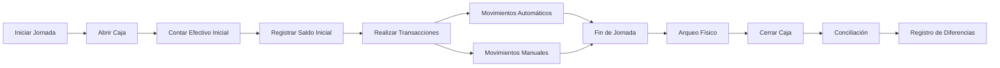

# Control de Caja

El módulo de Control de Caja de Fabrica Marie ERP permite gestionar el flujo de efectivo diario, desde la apertura de caja hasta el cierre con conciliación y arqueo. Cada usuario puede operar su propia caja de forma independiente.

## Concepto de Caja

### ¿Qué es una Caja?

Una caja es el control diario del efectivo y movimientos monetarios de un usuario (cajero, vendedor o administrador). Cada caja tiene:

- **Usuario responsable**: Quien opera la caja
- **Fecha**: Día específico (una caja por día por usuario)
- **Saldo inicial**: Monto con el que se abre
- **Saldo actual**: Balance en tiempo real
- **Estado**: ABIERTA o CERRADA

<Note>
  Solo puede haber **una caja abierta por día** en el sistema. Si alguien intenta abrir otra caja el mismo día, el sistema lo impide.
</Note>

## Apertura de Caja

### Proceso de Apertura

<Steps>
  <Step title="Verificar que no hay caja abierta">
    El sistema valida que no exista una caja abierta para la fecha actual.
  </Step>
  
  <Step title="Definir monto de apertura">
    El usuario ingresa el monto inicial con el que abre la caja (efectivo disponible).
  </Step>
  
  <Step title="Crear caja">
    Se registra la caja con:
    - Usuario: ID del usuario actual
    - Fecha: Fecha del sistema
    - Saldo inicial: Monto ingresado
    - Saldo actual: Igual al saldo inicial
    - Estado: ABIERTA
  </Step>
</Steps>

<Card title="Ejemplo de Apertura" icon="cash-register" color="green">
  ```
  Usuario: María García
  Fecha: 11/03/2026
  Monto de apertura: Q1,000.00
  Estado: ABIERTA
  ```
</Card>

<Warning>
  No se pueden registrar movimientos ni transacciones sin tener una caja abierta. Vendedores y cajeros deben abrir su caja al iniciar la jornada.
</Warning>

## Movimientos de Caja

### Tipos de Movimientos

Todos los movimientos de efectivo se registran automáticamente en la caja:

<CardGroup cols={2}>
  <Card title="Ingresos" icon="arrow-down" color="green">
    Dinero que **entra** a la caja:
    - Ventas de contado confirmadas
    - Adelantos de ventas a crédito
    - Abonos a cuentas por cobrar
    - Vueltos de viáticos
    - Depósitos
  </Card>
  
  <Card title="Egresos" icon="arrow-up" color="red">
    Dinero que **sale** de la caja:
    - Viáticos aprobados a vendedores
    - Gastos operativos
    - Retiros de efectivo
    - Pagos a proveedores
    - Salidas autorizadas
  </Card>
</CardGroup>

### Registro de Movimientos

Cada movimiento incluye:

- **Tipo**: INGRESO o EGRESO
- **Monto**: Cantidad de dinero
- **Categoría**: VENTA, VIATICO, ABONO, VUELTO, GASTO, RETIRO, etc.
- **Descripción**: Detalle del movimiento
- **Referencia**: Vinculación al documento origen (venta, viático, etc.)
- **Fecha y hora**: Timestamp automático

<Tip>
  Los movimientos vinculados a ventas, abonos y viáticos se crean **automáticamente**. No requieren registro manual.
</Tip>

### Movimientos Manuales

Los usuarios autorizados pueden registrar movimientos manuales para:

<CardGroup cols={2}>
  <Card title="Otros Ingresos" icon="plus-circle">
    - Depósitos bancarios no relacionados a ventas
    - Ajustes de caja (faltantes encontrados)
    - Ingresos varios
  </Card>
  
  <Card title="Otros Egresos" icon="minus-circle">
    - Gastos operativos (combustible, viáticos menores)
    - Retiros autorizados
    - Ajustes de caja (sobrantes retirados)
  </Card>
</CardGroup>

## Consulta de Movimientos

### Vista en Tiempo Real

Los usuarios pueden consultar:

- **Mi caja actual**: Estado y saldo de su caja abierta
- **Movimientos del día**: Lista cronológica de todos los movimientos
- **Todos los movimientos**: Historial completo de todas las cajas

### Ejemplo de Listado

```
--- Movimientos de Caja - 11/03/2026 ---

08:30  INGRESO  Q  150.00  VENTA      Venta confirmada #VTA-000123
09:15  EGRESO   Q  300.00  VIATICO    Viatico inicial Juan Pérez - Zona Norte
10:20  INGRESO  Q  450.00  VENTA      Venta confirmada #VTA-000124
11:00  INGRESO  Q  200.00  ABONO      Abono cuenta cliente Distribuidora X
14:30  EGRESO   Q   50.00  GASTO      Combustible vehículo V-001

Saldo Actual: Q1,450.00
```

## Cierre de Caja

### Proceso de Cierre

Al finalizar la jornada, el usuario cierra su caja:

<Steps>
  <Step title="Arqueo Físico">
    Contar manualmente el efectivo real en caja.
  </Step>
  
  <Step title="Ingresar Monto Real">
    El usuario ingresa en el sistema cuánto efectivo tiene físicamente.
  </Step>
  
  <Step title="Conciliación Automática">
    El sistema calcula:
    - **Saldo esperado** = Saldo inicial + Ingresos - Egresos
    - **Saldo real** = Monto ingresado por el usuario
    - **Diferencia** = Saldo real - Saldo esperado
  </Step>
  
  <Step title="Registro de Cierre">
    Se guarda el cierre en la tabla `cierres_caja` con:
    - Fecha y hora de cierre
    - Usuario que cerró
    - Monto esperado vs. real
    - Sobrante o faltante
    - Estado: CERRADA
  </Step>
</Steps>

### Ejemplo de Cierre

```
--- Cierre de Caja - 11/03/2026 ---

Saldo Inicial:        Q 1,000.00
Total Ingresos:       Q 2,450.00
Total Egresos:        Q   850.00
-------------------------------
Saldo Esperado:       Q 2,600.00

Saldo Real (contado): Q 2,580.00
-------------------------------
Faltante:             Q    20.00 ❌

Cerrado por: María García
Fecha: 11/03/2026 18:30:00
```

<Note>
  La diferencia (sobrante o faltante) se registra para auditoría. Si hay faltantes recurrentes, el administrador puede investigar.
</Note>

## Reportes de Caja

### Reporte por ID de Caja

Consultar una caja específica con:

<CardGroup cols={2}>
  <Card title="Datos Generales" icon="info-circle">
    - Usuario responsable
    - Fecha de la caja
    - Saldo inicial y actual
    - Estado
  </Card>
  
  <Card title="Movimientos" icon="list">
    - Lista completa de ingresos
    - Lista completa de egresos
    - Totales por categoría
  </Card>
  
  <Card title="Cierre" icon="door-closed">
    - Saldo esperado vs. real
    - Sobrante o faltante
    - Usuario que cerró
    - Fecha y hora de cierre
  </Card>
  
  <Card title="Resumen" icon="chart-pie">
    - Total de ingresos
    - Total de egresos
    - Balance neto del día
  </Card>
</CardGroup>

### Reporte por Usuario y Fecha

Consultar la caja de un usuario específico en una fecha determinada.

```
GET /api/caja/reporte-fecha?fecha=2026-03-11

Retorna el reporte completo de mi caja del 11/03/2026
```

### Historial de Cajas Cerradas

Los administradores pueden consultar todas las cajas cerradas con:

- Usuario responsable
- Fecha de cierre
- Saldo esperado vs. real
- Diferencias (sobrantes/faltantes)
- Estado de conciliación

<Tip>
  Este reporte es útil para detectar patrones de diferencias y evaluar el desempeño de los cajeros.
</Tip>

## Permisos y Roles

### ¿Quién puede acceder?

<CardGroup cols={3}>
  <Card title="Vendedor" icon="user">
    - Abrir su propia caja
    - Ver sus movimientos
    - Cerrar su caja
  </Card>
  
  <Card title="Cajero" icon="cash-register">
    - Abrir/cerrar caja
    - Ver todos los movimientos del día
    - Registrar movimientos manuales
  </Card>
  
  <Card title="Administrador" icon="user-shield">
    - Todas las funciones
    - Ver cajas de cualquier usuario
    - Reportes históricos completos
    - Auditoría de diferencias
  </Card>
</CardGroup>

<Warning>
  Solo el usuario que abrió una caja puede cerrarla. Los administradores pueden cerrar cajas de otros usuarios en casos excepcionales.
</Warning>

## Middleware: Caja Abierta

### Validación Automática

El sistema tiene un middleware `CajaAbierta` que valida que ciertas operaciones solo se puedan realizar si hay una caja abierta:

- Confirmar ventas
- Registrar abonos
- Aprobar viáticos
- Crear movimientos manuales

<Note>
  Si un usuario intenta realizar estas operaciones sin caja abierta, el sistema devuelve un error:
  
  ```json
  {
    "error": "No tiene una caja abierta. Debe abrir una caja para registrar movimientos."
  }
  ```
</Note>

## Integración con Otros Módulos

El módulo de caja se integra automáticamente con:

- **Ventas**: Registra ingresos al confirmar ventas de contado o crédito con adelanto
- **Gestión de Clientes**: Registra abonos a cuentas por cobrar
- **Recursos Humanos**: Registra egresos de viáticos aprobados y vueltos
- **Reportes**: Provee datos para conciliación y auditoría financiera

---

## Flujo de Trabajo Típico



<Tip>
  El control de caja es fundamental para la trazabilidad financiera. Asegúrate de realizar arqueos físicos diarios y conciliar las diferencias inmediatamente.
</Tip>