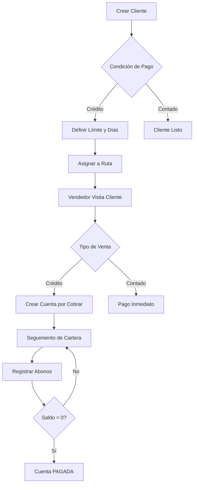

# Gestión de Clientes

El módulo de Gestión de Clientes de Fabrica Marie ERP funciona como un CRM (Customer Relationship Management) completo, permitiendo administrar la información de clientes, controlar cuentas por cobrar, registrar abonos y dar seguimiento a la cartera de clientes.

## Registro de Clientes

### Información del Cliente

Cada cliente en el sistema contiene:

<CardGroup cols={2}>
  <Card title="Datos Básicos" icon="address-card">
    - **Código de Cliente**: Identificador único
    - **Razón Social**: Nombre comercial o personal
    - **Tipo de Cliente**: TIENDA, DISTRIBUIDOR, MAYORISTA, CONSUMIDOR
    - **Dirección**: Ubicación física
    - **Teléfono**: Contacto
  </Card>
  
  <Card title="Configuración Comercial" icon="handshake">
    - **Condición de Pago**: CONTADO o CREDITO
    - **Límite de Crédito**: Monto máximo de deuda permitido
    - **Días de Crédito**: Plazo para pagar (ej: 30 días)
    - **Deuda Actual**: Saldo pendiente en tiempo real
    - **Estado**: Activo/Inactivo
  </Card>
</CardGroup>

### Tipos de Cliente

<CardGroup cols={2}>
  <Card title="Tienda" icon="store">
    Negocios minoristas que compran para reventa al consumidor final.
  </Card>
  
  <Card title="Distribuidor" icon="truck">
    Empresas que compran en grandes cantidades para redistribuir a otras tiendas.
  </Card>
  
  <Card title="Mayorista" icon="warehouse">
    Clientes que compran volúmenes muy grandes con descuentos especiales.
  </Card>
  
  <Card title="Consumidor Final" icon="user">
    Personas que compran para consumo propio, generalmente de contado.
  </Card>
</CardGroup>

### Validaciones al Crear Cliente

<Note>
  - El código de cliente debe ser único en el sistema
  - Si la condición de pago es CREDITO, se debe definir límite y días de crédito
  - Clientes de tipo CONSUMIDOR generalmente son de contado
</Note>

## Asociación con Rutas

### Asignación de Clientes a Rutas

Los clientes se pueden asociar a **rutas** específicas para organizar el trabajo de los vendedores:

- Un cliente puede estar en **múltiples rutas** (tabla pivot)
- Cada asignación tiene un **orden** que define la secuencia de visita
- Los vendedores visitan clientes según la ruta asignada

<Tip>
  Al crear o editar un cliente, se puede asignar directamente a una ruta. El sistema crea automáticamente la relación en la tabla `cliente_ruta`.
</Tip>

### Ejemplo de Asignación

```
Cliente: Distribuidora El Pacífico
Ruta: Ruta Norte - Zona 1
Orden: 3 (tercer cliente a visitar en la ruta)
```

## Cuentas por Cobrar

### ¿Qué es una Cuenta por Cobrar?

Cuando se confirma una **venta a crédito**, el sistema crea automáticamente una cuenta por cobrar que registra:

- **Cliente**: A quién se le debe cobrar
- **Venta asociada**: Referencia a la transacción origen
- **Monto total**: Valor total de la deuda
- **Saldo pendiente**: Cantidad que aún falta por pagar
- **Estado**: PENDIENTE, PARCIAL, PAGADO

### Estados de Cuenta

<CardGroup cols={3}>
  <Card title="PENDIENTE" icon="clock" color="orange">
    No se ha registrado ningún abono. El saldo pendiente es igual al monto total.
  </Card>
  
  <Card title="PARCIAL" icon="chart-pie" color="yellow">
    Se han realizado abonos, pero aún hay saldo pendiente.
  </Card>
  
  <Card title="PAGADO" icon="check-circle" color="green">
    La cuenta ha sido liquidada completamente. Saldo = 0.
  </Card>
</CardGroup>

### Ejemplo de Cuenta por Cobrar

```
--- Cuenta por Cobrar #47 ---

Cliente: Tienda San José
Venta: VTA-000234
Fecha: 10/03/2026

Monto Total:      Q 2,500.00
Saldo Pendiente:  Q 1,200.00
Estado: PARCIAL

Abonos realizados:
- 10/03/2026  Q  500.00  (adelanto en venta)
- 15/03/2026  Q  800.00  (abono #1)

Próximo vencimiento: 09/04/2026 (30 días crédito)
```

## Registro de Abonos

### Proceso de Abono

Cuando un cliente paga parcial o totalmente su deuda:

<Steps>
  <Step title="Seleccionar Cuenta">
    El usuario identifica la cuenta por cobrar del cliente.
  </Step>
  
  <Step title="Registrar Monto">
    Ingresa el monto que el cliente está pagando.
  </Step>
  
  <Step title="Método de Pago">
    Especifica cómo pagó: efectivo, transferencia, cheque, etc.
  </Step>
  
  <Step title="Actualización Automática">
    El sistema:
    - Registra el movimiento en **caja** como INGRESO
    - Crea el registro de **abono** vinculado a la cuenta
    - **Resta el monto** del saldo pendiente
    - Actualiza el **estado** (PARCIAL o PAGADO)
  </Step>
</Steps>

<Note>
  Los abonos requieren tener una **caja abierta**. El movimiento se registra automáticamente en la caja del usuario.
</Note>

### Ejemplo de Registro de Abono

```json
{
  "cuenta_id": 47,
  "caja_id": 15,
  "monto": 800.00,
  "metodo_pago": "TRANSFERENCIA"
}
```

**Resultado:**
- Saldo pendiente: Q1,200.00 - Q800.00 = Q400.00
- Estado: PARCIAL
- Movimiento de caja: INGRESO Q800.00

### Anulación de Abonos

<Warning>
  Los abonos pueden ser anulados por usuarios con permisos especiales. Al anular:
  - Se revierte el movimiento de caja
  - Se devuelve el monto al saldo pendiente
  - Se mantiene registro histórico de la anulación
</Warning>

## Seguimiento de Cartera

### Vista de Cuentas Activas

Los administradores y gerentes pueden consultar:

- **Total de cuentas por cobrar activas**
- **Saldo total pendiente** de cobro
- **Cuentas por cliente**: Agrupadas por cliente
- **Cuentas por vendedor**: Agrupadas por el vendedor responsable

### Clientes Morosos

<Card title="Clientes Delinquentes" icon="triangle-exclamation" color="red">
  Clientes con cuentas vencidas según los días de crédito configurados.
  
  **Criterio:**
  - Fecha de venta + días de crédito < fecha actual
  - Estado: PENDIENTE o PARCIAL
  
  **Acciones:**
  - Notificación al vendedor
  - Restricción de nuevas ventas a crédito
  - Seguimiento de cobro
</Card>

### Ejemplo de Reporte de Cartera

```
--- Reporte de Cartera - Marzo 2026 ---

Cuentas Activas:        87 cuentas
Saldo Total Pendiente: Q145,200.00

Por Estado:
  PENDIENTE:  42 cuentas  Q 78,500.00
  PARCIAL:    45 cuentas  Q 66,700.00
  PAGADO:      0 cuentas  Q      0.00

Cuentas Vencidas:       23 cuentas  Q 34,800.00 ⚠️
```

## Historial del Cliente

### Vista de Cliente Individual

Al consultar un cliente específico, se muestra:

<CardGroup cols={2}>
  <Card title="Datos Generales" icon="user">
    - Información básica del cliente
    - Condición de pago
    - Límite y días de crédito
    - Deuda actual
  </Card>
  
  <Card title="Rutas Asignadas" icon="route">
    - Rutas en las que está el cliente
    - Orden de visita en cada ruta
  </Card>
  
  <Card title="Historial de Ventas" icon="cart-shopping">
    - Todas las ventas realizadas al cliente
    - Fechas, montos y productos
    - Ventas pendientes vs. completadas
  </Card>
  
  <Card title="Cuentas por Cobrar" icon="credit-card">
    - Cuentas activas
    - Historial de abonos
    - Saldo total pendiente
  </Card>
</CardGroup>

## Límite de Crédito

### Validación Automática

Al crear una venta a crédito, el sistema valida:

```javascript
deuda_actual + monto_nueva_venta <= limite_credito
```

Si el cliente excede su límite de crédito:

<Warning>
  ```json
  {
    "error": "El cliente ha excedido su límite de crédito.",
    "limite_credito": 10000.00,
    "deuda_actual": 8500.00,
    "monto_venta": 2000.00,
    "excedente": 500.00
  }
  ```
  
  El sistema impide la creación de la venta hasta que el cliente abone o se autorice un incremento de límite.
</Warning>

## Actualización de Deuda

### Cálculo Automático

La **deuda actual** de un cliente se actualiza automáticamente:

- **Al confirmar una venta a crédito**: Se suma el total neto al campo `deuda_actual`
- **Al registrar un abono**: Se resta el monto del abono
- **Al anular una venta**: Se resta el monto de la venta
- **Al anular un abono**: Se suma el monto del abono

<Tip>
  El campo `deuda_actual` en la tabla `clientes` es un resumen en tiempo real. Los detalles completos están en las cuentas por cobrar y sus abonos.
</Tip>

## Reportes de Clientes

### Reportes Disponibles

<CardGroup cols={2}>
  <Card title="Listado de Clientes" icon="list">
    Todos los clientes activos con su información básica y deuda actual.
  </Card>
  
  <Card title="Cartera por Vendedor" icon="user-tie">
    Cuentas por cobrar agrupadas por el vendedor que generó la venta.
  </Card>
  
  <Card title="Clientes Morosos" icon="exclamation-triangle">
    Lista de clientes con pagos vencidos, ordenados por antigüedad de la deuda.
  </Card>
  
  <Card title="Historial de Abonos" icon="money-bill">
    Todos los pagos registrados en un período, con cliente, monto y método de pago.
  </Card>
</CardGroup>

## Permisos y Roles

### ¿Quién puede acceder?

- **Administrador**: Acceso completo, puede editar límites de crédito
- **Gerente de Ventas**: Ver cartera completa, gestionar clientes y abonos
- **Vendedor**: Ver solo sus clientes asignados y sus cuentas
- **Cajero**: Registrar abonos, ver cuentas por cobrar
- **Cobrador**: Rol especializado para seguimiento de cartera morosa

<Note>
  Los vendedores solo pueden ver clientes de sus rutas asignadas, protegiendo la privacidad comercial.
</Note>

## Integración con Otros Módulos

El módulo de clientes se integra con:

- **Ventas**: Crea automáticamente cuentas por cobrar al vender a crédito
- **Caja**: Registra abonos como movimientos de ingreso
- **Rutas**: Organiza clientes por zona geográfica para visitas
- **Reportes**: Genera estadísticas de cartera y desempeño de cobranza

---

## Flujo de Trabajo Típico



<Tip>
  Mantén actualizado el límite de crédito de los clientes según su comportamiento de pago. Clientes puntuales pueden recibir incrementos, mientras que morosos deben ser restringidos.
</Tip>