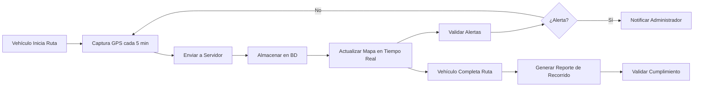

# Monitoreo GPS

El módulo de Monitoreo GPS de Fabrica Marie ERP permite rastrear en tiempo real la ubicación de los vehículos de la flota, registrar historial de recorridos y validar el cumplimiento de rutas planificadas.

## Concepto de Punto GPS

### ¿Qué es un Punto GPS?

Un punto GPS es un registro de ubicación geográfica capturado en un momento específico. Cada punto contiene:

<CardGroup cols={2}>
  <Card title="Ubicación" icon="map-pin">
    - **Latitud**: Coordenada norte-sur
    - **Longitud**: Coordenada este-oeste
    - **Altitud**: Altura sobre nivel del mar (opcional)
  </Card>
  
  <Card title="Metadatos" icon="info-circle">
    - **Vehículo**: ID del vehículo rastreado
    - **Fecha y Hora**: Timestamp de captura (`captured_at`)
    - **Velocidad**: Velocidad del vehículo en ese momento (opcional)
    - **Precisión**: Exactitud de la señal GPS en metros
  </Card>
</CardGroup>

### Ejemplo de Punto GPS

```json
{
  "vehiculo_id": 3,
  "latitude": 14.6349,
  "longitude": -90.5069,
  "altitude": 1502,
  "speed": 45.5,
  "accuracy": 8.2,
  "captured_at": "2026-03-11T10:23:45Z"
}
```

<Note>
  Las coordenadas deben registrarse con precisión de al menos 4 decimales para garantizar ubicación exacta (aproximadamente 10 metros de precisión).
</Note>

## Registro de Puntos GPS

### Métodos de Captura

<CardGroup cols={3}>
  <Card title="App Móvil" icon="mobile-screen">
    La aplicación móvil del vendedor captura automáticamente puntos GPS a intervalos regulares (ej: cada 5 minutos).
  </Card>
  
  <Card title="Dispositivo GPS" icon="satellite">
    Rastreadores GPS instalados en vehículos envían datos continuamente al servidor.
  </Card>
  
  <Card title="Registro Manual" icon="hand-pointer">
    En casos especiales, un administrador puede registrar puntos GPS manualmente.
  </Card>
</CardGroup>

### Endpoint de Registro

```javascript
POST /api/gps-points

{
  "vehiculo_id": 3,
  "latitude": 14.6349,
  "longitude": -90.5069,
  "altitude": 1502,
  "speed": 45.5,
  "accuracy": 8.2,
  "captured_at": "2026-03-11T10:23:45Z"
}
```

<Tip>
  Para optimizar el uso de datos móviles y almacenamiento, configura intervalos de captura apropiados: cada 5-10 minutos en ruta, y solo al iniciar/finalizar en puntos de venta.
</Tip>

## Consulta de Ubicaciones

### Listado de Puntos GPS

Al consultar todos los puntos GPS, el sistema devuelve:

```json
[
  {
    "id": 1234,
    "latitude": 14.6349,
    "longitude": -90.5069,
    "captured_at": "2026-03-11T10:23:45Z",
    "speed": 45.5,
    "vehiculo": {
      "id": 3,
      "codigo": "VEH-001",
      "placa": "P-123ABC",
      "marca": "Toyota",
      "modelo": "Hilux"
    }
  }
]
```

**Ordenamiento:** Los puntos se devuelven ordenados por `captured_at` descendente (más recientes primero).

### Filtrado por Vehículo

Para obtener el recorrido de un vehículo específico:

```javascript
GET /api/gps-points?vehiculo_id=3
```

### Filtrado por Fecha

Para obtener puntos GPS de un período específico:

```javascript
GET /api/gps-points?fecha_desde=2026-03-11&fecha_hasta=2026-03-11
```

## Visualización en Mapa

### Mapa en Tiempo Real

La interfaz web puede mostrar:

<CardGroup cols={2}>
  <Card title="Ubicación Actual" icon="location-crosshairs">
    El último punto GPS registrado de cada vehículo, mostrando su posición actual en el mapa.
  </Card>
  
  <Card title="Historial de Recorrido" icon="route">
    Una línea conectando todos los puntos GPS del día para visualizar la ruta seguida.
  </Card>
  
  <Card title="Velocidad" icon="gauge-high">
    Indicador de velocidad actual basado en el último punto GPS.
  </Card>
  
  <Card title="Estado" icon="circle">
    Ícono de color según estado: en movimiento (verde), detenido (amarillo), sin señal (gris).
  </Card>
</CardGroup>

### Ejemplo de Integración con Mapas

```javascript
// Usando Google Maps o Leaflet
const puntos = await fetch('/api/gps-points?vehiculo_id=3');
const coordenadas = puntos.map(p => [p.latitude, p.longitude]);

// Dibujar ruta en el mapa
const polyline = L.polyline(coordenadas, {color: 'blue'}).addTo(map);
map.fitBounds(polyline.getBounds());
```

## Reportes de GPS

### Reporte de Recorrido Diario

<Card title="Recorrido del Día" icon="calendar-day">
  Muestra todos los puntos GPS de un vehículo en un día específico:
  
  - Punto de inicio (primer GPS del día)
  - Puntos intermedios (paradas y recorrido)
  - Punto final (último GPS del día)
  - Distancia total recorrida (estimada)
  - Tiempo total en movimiento
  - Tiempo total detenido
</Card>

### Cálculo de Distancia

Usando la fórmula de Haversine, se puede calcular la distancia entre puntos GPS consecutivos:

```javascript
function calcularDistancia(lat1, lon1, lat2, lon2) {
  const R = 6371; // Radio de la Tierra en km
  const dLat = (lat2 - lat1) * Math.PI / 180;
  const dLon = (lon2 - lon1) * Math.PI / 180;
  
  const a = Math.sin(dLat/2) * Math.sin(dLat/2) +
            Math.cos(lat1 * Math.PI / 180) * Math.cos(lat2 * Math.PI / 180) *
            Math.sin(dLon/2) * Math.sin(dLon/2);
  
  const c = 2 * Math.atan2(Math.sqrt(a), Math.sqrt(1-a));
  return R * c; // Distancia en km
}
```

### Reporte de Cumplimiento de Ruta

<Card title="Validación de Ruta" icon="clipboard-check" color="blue">
  Compara los puntos GPS reales con los clientes de la ruta planificada:
  
  **¿El vendedor visitó los clientes asignados?**
  
  - Se define un radio de tolerancia (ej: 100 metros)
  - Se verifica si hay puntos GPS dentro del radio de cada cliente
  - Se marca como "visitado" o "no visitado"
  - Se genera un % de cumplimiento de ruta
</Card>

### Ejemplo de Validación

```
Ruta: Ruta Norte - Zona 1
Fecha: 11/03/2026
Vendedor: Juan Pérez
Vehículo: VEH-001

Clientes planificados: 15
Clientes visitados: 13
Cumplimiento: 87%

Clientes no visitados:
- Tienda Don Pedro (orden 7)
- Distribuidora Central (orden 12)
```

## Alertas Basadas en GPS

### Tipos de Alertas

<CardGroup cols={2}>
  <Card title="Salida de Zona" icon="map-location-dot">
    Alerta si el vehículo sale del perímetro geográfico asignado a su ruta.
  </Card>
  
  <Card title="Velocidad Excesiva" icon="triangle-exclamation">
    Notifica si el vehículo supera la velocidad máxima permitida (ej: 80 km/h).
  </Card>
  
  <Card title="Tiempo Detenido" icon="clock">
    Alerta si el vehículo está detenido más de X minutos fuera de un punto de venta.
  </Card>
  
  <Card title="Sin Señal GPS" icon="signal">
    Notifica si no se ha recibido señal GPS del vehículo en más de 30 minutos.
  </Card>
</CardGroup>

### Configuración de Alertas

```json
{
  "tipo": "VELOCIDAD_EXCESIVA",
  "vehiculo_id": 3,
  "limite_velocidad": 80,
  "notificar_a": ["gerente@empresa.com", "seguridad@empresa.com"]
}
```

## Historial de Ubicaciones

### Consulta de Historial

Para consultar el historial completo de un vehículo:

```javascript
GET /api/vehiculos/3/gps-history?fecha_desde=2026-03-01&fecha_hasta=2026-03-11
```

**Respuesta:**
```json
{
  "vehiculo": {
    "id": 3,
    "codigo": "VEH-001",
    "placa": "P-123ABC"
  },
  "periodo": {
    "desde": "2026-03-01",
    "hasta": "2026-03-11"
  },
  "estadisticas": {
    "total_puntos": 2845,
    "distancia_total_km": 456.7,
    "dias_activos": 9,
    "velocidad_promedio": 42.3
  },
  "puntos": [...]
}
```

## Optimización de Almacenamiento

### Estrategias de Retención

<CardGroup cols={2}>
  <Card title="Almacenamiento Completo" icon="database">
    **Últimos 30 días:** Todos los puntos GPS con precisión completa.
  </Card>
  
  <Card title="Compresión Temporal" icon="compress">
    **31-90 días:** Reducir densidad de puntos (ej: cada 15 minutos en lugar de cada 5).
  </Card>
  
  <Card title="Resumen Histórico" icon="chart-line">
    **Más de 90 días:** Conservar solo puntos clave (inicio, fin, paradas largas) y estadísticas diarias.
  </Card>
  
  <Card title="Archivado" icon="archive">
    **Más de 1 año:** Mover a almacenamiento frío o eliminar según política de retención.
  </Card>
</CardGroup>

<Tip>
  Implementa trabajos programados (cron jobs) que compriman o archiven datos GPS antiguos para optimizar el rendimiento de la base de datos.
</Tip>

## Privacidad y Seguridad

### Consideraciones Legales

<Warning>
  El rastreo GPS de vehículos debe cumplir con leyes de privacidad laboral:
  
  - Informar a los empleados sobre el rastreo
  - Obtener consentimiento cuando sea requerido
  - Rastrear solo durante horas laborales (opcional)
  - No usar datos para fines distintos a operación comercial
  - Proteger datos GPS contra acceso no autorizado
</Warning>

### Control de Acceso

<CardGroup cols={3}>
  <Card title="Administrador" icon="user-shield">
    Acceso completo al historial GPS de todos los vehículos.
  </Card>
  
  <Card title="Gerente de Flota" icon="user-tie">
    Ver ubicación en tiempo real y reportes históricos.
  </Card>
  
  <Card title="Vendedor" icon="user">
    Ver solo su propio historial GPS (opcional, según política).
  </Card>
</CardGroup>

## Edición y Eliminación

### Editar Punto GPS

Los administradores pueden corregir puntos GPS erróneos:

```javascript
PUT /api/gps-points/{id}

{
  "latitude": 14.6350,
  "longitude": -90.5070
}
```

<Note>
  Solo edita puntos GPS si hay un error evidente. Los datos GPS deben mantenerse lo más originales posible para auditoría.
</Note>

### Eliminar Punto GPS

Para eliminar un punto GPS específico:

```javascript
DELETE /api/gps-points/{id}
```

<Warning>
  La eliminación es permanente. Solo usuarios con permisos especiales deben poder eliminar datos GPS.
</Warning>

## Integración con Otros Módulos

El módulo de GPS se integra con:

- **Vehículos**: Cada punto GPS está asociado a un vehículo específico
- **Rutas**: Validación de cumplimiento de rutas planificadas
- **Salidas de Fábrica**: Rastreo de vehículos durante salidas activas
- **Ventas**: Verificación de visitas a clientes
- **Recursos Humanos**: Cálculo de viáticos por distancia recorrida
- **Reportes**: Análisis de eficiencia operativa

---

## Flujo de Trabajo Típico



<Note>
  El monitoreo GPS es una herramienta poderosa para mejorar la eficiencia operativa, garantizar la seguridad de la flota y verificar el cumplimiento de rutas planificadas.
</Note>