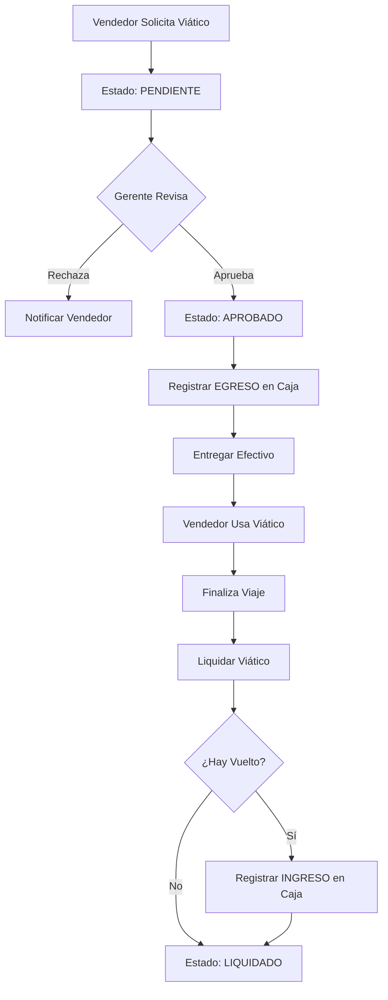

# Gestión de Recursos Humanos

El módulo de Gestión de Recursos Humanos de Fabrica Marie ERP permite administrar la información de empleados, controlar viáticos para vendedores, gestionar bonos e incentivos, y llevar registro de asistencia.

## Gestión de Empleados

### Registro de Usuarios

Cada empleado en el sistema es un **usuario** con credenciales de acceso. Al crear un usuario, se registra:

<CardGroup cols={2}>
  <Card title="Información de Acceso" icon="key">
    - **Username**: Nombre de usuario único
    - **Email**: Correo electrónico único
    - **Password**: Contraseña encriptada (hash)
    - **Estado**: Activo/Inactivo
  </Card>
  
  <Card title="Información Personal" icon="id-card">
    - **Nombre Completo**: Identificación del empleado
    - **Roles**: ADMINISTRADOR, GERENTE, VENDEDOR, CAJERO, etc.
    - **Permisos**: Acciones específicas autorizadas
    - **Fecha de Creación**: Timestamp de registro
  </Card>
</CardGroup>

### Roles Disponibles

<CardGroup cols={3}>
  <Card title="ADMINISTRADOR" icon="user-shield">
    Acceso completo al sistema, puede crear usuarios y asignar permisos.
  </Card>
  
  <Card title="GERENTE" icon="user-tie">
    Supervisión de operaciones, acceso a reportes y configuraciones.
  </Card>
  
  <Card title="VENDEDOR" icon="user">
    Registro de ventas, gestión de clientes en ruta, consulta de inventario propio.
  </Card>
  
  <Card title="CAJERO" icon="cash-register">
    Control de caja, registro de abonos, movimientos de efectivo.
  </Card>
  
  <Card title="DESPACHADOR" icon="truck-loading">
    Creación de salidas de fábrica, gestión de inventario.
  </Card>
  
  <Card title="COBRADOR" icon="money-bill">
    Seguimiento de cuentas por cobrar, registro de abonos.
  </Card>
</CardGroup>

### Información Salarial

Al crear un usuario, se registra su información salarial en la tabla `informacion_salarial_emp`:

```json
{
  "usuario_id": 15,
  "sueldo_base": 3500.00,
  "horas_extra": 0.00,
  "afp": 181.65,
  "bonos": 0.00,
  "deducciones": 0.00
}
```

<Note>
  El cálculo de AFP (Administradora de Fondos de Pensiones) se realiza automáticamente según la legislación local, típicamente 4.83% del sueldo base en Guatemala.
</Note>

## Vendedores

### Registro Especial de Vendedores

Cuando se asigna el rol **VENDEDOR** a un usuario, el sistema crea automáticamente un registro en la tabla `vendedores`:

```json
{
  "usuario_id": 15,
  "activo": true
}
```

Esto permite:
- Asociar salidas de fábrica al vendedor
- Controlar stock de vendedor
- Registrar ventas por vendedor
- Asignar vehículos
- Gestionar viáticos

<Tip>
  Un usuario puede tener múltiples roles. Por ejemplo, un CAJERO también puede ser VENDEDOR.
</Tip>

## Gestión de Viáticos

### ¿Qué son los Viáticos?

Los viáticos son **gastos de viaje** que la empresa adelanta a los vendedores para cubrir costos operativos durante su recorrido de ventas:

- Combustible
- Alimentación
- Hospedaje (si aplica)
- Peajes y estacionamientos
- Gastos menores de operación

### Tipos de Viáticos

<CardGroup cols={2}>
  <Card title="Viático Inicial" icon="flag-checkered" color="blue">
    Monto fijo entregado al inicio del período (semanal, quincenal) para cubrir gastos recurrentes.
  </Card>
  
  <Card title="Viático de Viaje" icon="route" color="green">
    Monto específico para una ruta o zona particular, calculado según distancia y duración estimada.
  </Card>
</CardGroup>

### Registro de Viático

Para crear un viático:

```json
{
  "vendedor_id": 7,
  "tipo": "viaje",
  "fecha": "2026-03-11",
  "monto": 500.00,
  "zona": "Zona Norte",
  "ruta_id": 5,
  "descripcion": "Viáticos para ruta de 3 días en Zona Norte",
  "estado": "PENDIENTE"
}
```

<Note>
  Los viáticos se crean en estado **PENDIENTE** y deben ser **APROBADOS** por un gerente antes de realizar el desembolso.
</Note>

### Estados de Viáticos

<CardGroup cols={3}>
  <Card title="PENDIENTE" icon="clock" color="yellow">
    El viático ha sido solicitado pero aún no se ha aprobado ni entregado.
  </Card>
  
  <Card title="APROBADO" icon="check-circle" color="green">
    El viático fue aprobado y el dinero se entregó al vendedor. Se registra automáticamente un **EGRESO en caja**.
  </Card>
  
  <Card title="LIQUIDADO" icon="file-invoice-dollar" color="blue">
    El vendedor devolvió el dinero no utilizado y presentó comprobantes. El viático está cerrado.
  </Card>
</CardGroup>

### Aprobación de Viático

Cuando un gerente aprueba un viático:

<Steps>
  <Step title="Cambiar Estado">
    El viático pasa de PENDIENTE a APROBADO.
  </Step>
  
  <Step title="Registro en Caja">
    Se crea automáticamente un movimiento de caja:
    - **Tipo:** EGRESO
    - **Categoría:** VIATICO
    - **Monto:** El monto del viático
    - **Descripción:** "Viatico [tipo] para [vendedor] - [zona]. Viatico #[id]"
  </Step>
  
  <Step title="Notificación">
    El vendedor es notificado que puede recoger el dinero.
  </Step>
</Steps>

### Liquidación de Viático

Al finalizar el viaje, el vendedor debe liquidar el viático:

```json
{
  "usado": 450.00,
  "vuelto": 50.00,
  "comprobante": "FACTURA-12345"
}
```

**Validaciones:**
- `usado + vuelto` debe ser igual al `monto` entregado
- Si hay vuelto > 0, se registra un **INGRESO en caja** automáticamente

<Warning>
  Un viático ya liquidado no puede volver a liquidarse. El sistema valida el estado antes de procesar la liquidación.
</Warning>

## Bonificaciones e Incentivos

### Tipos de Bonos

<CardGroup cols={2}>
  <Card title="Bono por Cumplimiento" icon="trophy">
    Incentivo por alcanzar metas de ventas mensuales o trimestrales.
  </Card>
  
  <Card title="Comisiones" icon="percent">
    Porcentaje sobre las ventas realizadas por el vendedor.
  </Card>
  
  <Card title="Bono por Cobranza" icon="money-bill">
    Incentivo por recuperar cuentas morosas o cobrar puntualmente.
  </Card>
  
  <Card title="Bono Extraordinario" icon="gift">
    Reconocimiento especial por desempeño excepcional.
  </Card>
</CardGroup>

### Registro en Información Salarial

Los bonos se registran en el campo `bonos` de la tabla `informacion_salarial_emp`:

```sql
UPDATE informacion_salarial_emp
SET bonos = bonos + 800.00
WHERE usuario_id = 15;
```

<Tip>
  Los bonos se calculan típicamente al cierre de mes o período de pago y se reflejan en la nómina siguiente.
</Tip>

## Control de Asistencia

### Registro de Asistencia

El sistema puede integrarse con:

- **Reloj checador biométrico**
- **App móvil** con geolocalización
- **Registro manual** por supervisor

### Información de Asistencia

Cada registro de asistencia incluye:

- Usuario/Empleado
- Fecha
- Hora de entrada
- Hora de salida
- Total de horas trabajadas
- Horas extra (si aplica)
- Justificaciones de ausencias

## Reportes de Recursos Humanos

### Reportes Disponibles

<CardGroup cols={2}>
  <Card title="Nómina" icon="file-invoice-dollar">
    - Sueldo base por empleado
    - Bonos del período
    - Deducciones (AFP, ISR, etc.)
    - Total a pagar
  </Card>
  
  <Card title="Viáticos" icon="route">
    - Viáticos aprobados por período
    - Viáticos pendientes de liquidación
    - Total gastado en viáticos
    - Vueltos recuperados
  </Card>
  
  <Card title="Asistencia" icon="calendar-check">
    - Días trabajados por empleado
    - Ausencias y justificaciones
    - Horas extra
    - Puntualidad
  </Card>
  
  <Card title="Desempeño de Vendedores" icon="chart-line">
    - Ventas por vendedor
    - Cumplimiento de metas
    - Comisiones ganadas
    - Eficiencia en ruta
  </Card>
</CardGroup>

## Gestión de Usuarios

### Creación de Usuario

<Steps>
  <Step title="Ingresar Datos Básicos">
    Username, email, nombre completo, contraseña.
  </Step>
  
  <Step title="Asignar Roles">
    Seleccionar uno o más roles del sistema.
  </Step>
  
  <Step title="Información Salarial">
    Ingresar sueldo base, horas extra autorizadas, AFP.
  </Step>
  
  <Step title="Crear Usuario">
    El sistema:
    - Encripta la contraseña con Hash
    - Crea el usuario en la tabla `usuarios`
    - Asocia roles en `usuario_rol`
    - Crea información salarial en `informacion_salarial_emp`
    - Si es vendedor, crea registro en `vendedores`
  </Step>
</Steps>

### Listado de Usuarios

```json
[
  {
    "id": 15,
    "username": "jperez",
    "email": "jperez@empresa.com",
    "nombre": "Juan Pérez",
    "activo": true,
    "deleted": false,
    "roles": [
      { "id": 3, "nombre": "VENDEDOR" }
    ]
  }
]
```

<Note>
  Los usuarios con `deleted: true` no se muestran en listados activos, pero permanecen en la base de datos para auditoría.
</Note>

## Permisos Granulares

### Sistema de Permisos

Además de roles, el sistema soporta permisos específicos:

- `stock.negativo`: Permitir confirmar ventas con stock insuficiente
- `ventas.anular`: Anular ventas confirmadas
- `caja.cerrar_otras`: Cerrar cajas de otros usuarios
- `usuarios.crear`: Crear nuevos usuarios
- `reportes.financieros`: Ver reportes financieros sensibles

### Asignación de Permisos

Los permisos se asignan a **roles**, no a usuarios individuales:

```json
{
  "rol_id": 1,
  "permisos": ["stock.negativo", "ventas.anular", "caja.cerrar_otras"]
}
```

<Tip>
  Para casos excepcionales, considera crear roles específicos (ej: "VENDEDOR_SENIOR") con permisos adicionales en lugar de otorgar permisos individuales.
</Tip>

## Integración con Otros Módulos

El módulo de recursos humanos se integra con:

- **Caja**: Registro de egresos de viáticos aprobados y vueltos
- **Ventas**: Asociación de ventas al vendedor responsable
- **Rutas**: Asignación de vendedores a rutas específicas
- **Vehículos**: Asignación de vehículos a vendedores
- **Reportes**: Análisis de desempeño y cálculo de comisiones

---

## Flujo de Trabajo: Viáticos



<Note>
  El control de viáticos es esencial para la transparencia financiera. Asegúrate de que todos los viáticos se liquiden dentro de 7 días posteriores al regreso del vendedor.
</Note>