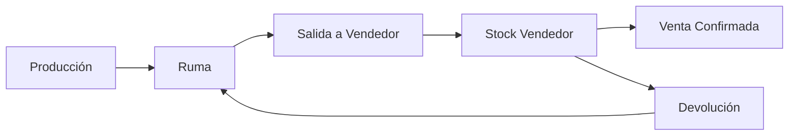

# Gestión de Inventario

El módulo de Gestión de Inventario de Fabrica Marie ERP permite controlar todo el ciclo de vida del inventario desde la producción hasta la distribución, incluyendo el catálogo de productos, las rumas (ubicaciones de almacenamiento), movimientos de stock, salidas a vendedores y devoluciones.

## Catálogo de Productos

### Registro de Productos

Cada producto en el sistema contiene información completa:

<CardGroup cols={2}>
  <Card title="Información Básica" icon="tag">
    - **SKU**: Código único del producto
    - **Nombre y Descripción**: Identificación comercial
    - **Categoría**: Clasificación del producto
    - **Marca**: Fabricante o marca comercial
  </Card>
  
  <Card title="Información Comercial" icon="dollar-sign">
    - **Precio Base**: Precio de venta estándar
    - **Costo**: Costo de producción
    - **Presentación**: Formato de empaque
    - **Unidad de Medida**: Unidad, caja, paquete, etc.
  </Card>
</CardGroup>

<Card title="Control de Stock" icon="warehouse">
  - **Stock Mínimo**: Nivel de alerta para reposición
  - **Peso**: Para cálculos de transporte
  - **Estado**: Activo/Inactivo
</Card>

### Alertas de Stock Bajo

El sistema monitorea automáticamente los niveles de inventario y genera alertas cuando los productos alcanzan o caen por debajo del stock mínimo configurado. Los administradores pueden consultar en tiempo real qué productos necesitan reposición.

<Note>
  Las alertas de stock mínimo ayudan a prevenir quiebres de inventario y aseguran disponibilidad continua para las ventas.
</Note>

## Sistema de Rumas

### ¿Qué son las Rumas?

Las rumas son ubicaciones físicas de almacenamiento dentro de la fábrica o bodega donde se organiza el inventario. Cada ruma tiene:

- **Código único**: Identificador alfanumérico (ej: RUMA-A1)
- **Nombre**: Descripción de la ubicación
- **Ubicación física**: Dirección exacta en el almacén
- **Capacidad**: Número máximo de unidades que puede almacenar
- **Condiciones**: Temperatura, humedad, etc.
- **Estado**: ACTIVA, INACTIVA, MANTENIMIENTO, LLENA

### Gestión de Rumas

<CardGroup cols={2}>
  <Card title="Crear Ruma" icon="plus">
    Los administradores pueden crear nuevas rumas definiendo su capacidad y condiciones de almacenamiento.
  </Card>
  
  <Card title="Monitoreo de Capacidad" icon="gauge">
    El sistema calcula automáticamente el stock actual vs. capacidad de cada ruma, mostrando el nivel de ocupación.
  </Card>
  
  <Card title="Organización por Producto" icon="layer-group">
    Cada ruma puede contener múltiples productos, facilitando la visualización de qué productos están en cada ubicación.
  </Card>
  
  <Card title="Control de Estado" icon="toggle-on">
    Las rumas se pueden marcar como inactivas o en mantenimiento para controlar el acceso temporal.
  </Card>
</CardGroup>

<Tip>
  No se puede eliminar una ruma que tiene stock registrado. Primero debe trasladarse el inventario a otra ubicación.
</Tip>

## Movimientos de Stock

### Tipos de Movimientos

El sistema registra automáticamente todos los movimientos de inventario:

<CardGroup cols={3}>
  <Card title="Entradas" icon="arrow-down" color="green">
    - Producción de fábrica
    - Devoluciones buenas de vendedores
    - Ajustes de inventario (incrementos)
  </Card>
  
  <Card title="Salidas" icon="arrow-up" color="orange">
    - Despachos a vendedores
    - Ventas confirmadas
    - Ajustes de inventario (decrementos)
  </Card>
  
  <Card title="Especiales" icon="exchange">
    - Traslados entre rumas
    - Devoluciones dañadas (baja de inventario)
    - Mermas y pérdidas
  </Card>
</CardGroup>

### Trazabilidad Completa

Cada movimiento registra:
- Fecha y hora exacta
- Usuario responsable
- Producto y cantidad
- Ruma de origen/destino
- Motivo o descripción
- Referencia al documento relacionado (venta, salida, devolución)

## Salidas de Fábrica

### Proceso de Despacho a Vendedores

Las salidas de fábrica son asignaciones de inventario a vendedores para que realicen ventas en ruta:

1. **Crear Salida**: Se especifica vendedor, vehículo, ruta y zona
2. **Agregar Productos**: Se seleccionan productos y cantidades desde las rumas
3. **Estado PENDIENTE**: La salida queda registrada
4. **Estado EN_RUTA**: El vendedor confirma la salida
5. **Estado COMPLETADO**: Al finalizar la jornada

<Note>
  Cuando se crea una salida, el stock se descuenta automáticamente de la ruma y se asigna al **Stock de Vendedor**, creando un inventario móvil que el vendedor lleva consigo.
</Note>

### Restricciones de Seguridad

<CardGroup cols={2}>
  <Card title="Un Vendedor, Una Salida" icon="user-lock">
    Un vendedor no puede tener dos salidas simultáneas activas (PENDIENTE o EN_RUTA).
  </Card>
  
  <Card title="Un Vehículo, Una Salida" icon="truck">
    Cada vehículo solo puede estar asignado a una salida activa a la vez.
  </Card>
</CardGroup>

## Stock de Vendedor

Cada vendedor tiene su propio inventario móvil que incluye:

- **Cantidad inicial**: Lo despachado desde fábrica
- **Stock reservado**: Ventas en borrador pendientes de confirmar
- **Cantidad vendida**: Productos ya vendidos y confirmados
- **Cantidad devuelta**: Productos retornados a fábrica
- **Stock disponible**: `cantidad - stock_reservado - vendido - devuelto`

<Tip>
  El sistema permite reservar stock temporalmente cuando se crea una venta en borrador, asegurando que no se venda más de lo disponible.
</Tip>

## Devoluciones

### Tipos de Devoluciones

<CardGroup cols={2}>
  <Card title="Devolución Buena" icon="check-circle" color="green">
    Productos en perfecto estado que se retornan al inventario de la ruma original.
  </Card>
  
  <Card title="Devolución Mala" icon="times-circle" color="red">
    Productos dañados, vencidos o defectuosos que se dan de baja del inventario.
  </Card>
</CardGroup>

### Proceso de Devolución

1. **Registro**: El vendedor o administrador crea la devolución
2. **Estado PENDIENTE**: Requiere revisión
3. **Aceptar o Rechazar**: 
   - Si se **acepta** una devolución buena: el stock regresa a la ruma
   - Si se **acepta** una devolución mala: se registra como pérdida
   - Si se **rechaza**: no hay movimiento de stock

<Note>
  Las devoluciones aceptadas actualizan automáticamente el stock del vendedor, descontando de su inventario móvil.
</Note>

## Reportes de Inventario

### Reportes Disponibles

<CardGroup cols={2}>
  <Card title="Stock Actual por Ruma" icon="chart-bar">
    Visualiza el inventario disponible en cada ubicación física del almacén.
  </Card>
  
  <Card title="Kardex de Producto" icon="file-lines">
    Historial completo de movimientos de un producto específico con saldos acumulados.
  </Card>
  
  <Card title="Stock de Vendedores" icon="users">
    Inventario móvil de cada vendedor en ruta, incluyendo reservas y ventas.
  </Card>
  
  <Card title="Productos Bajo Stock" icon="triangle-exclamation">
    Lista de productos que han alcanzado el nivel mínimo y requieren reposición.
  </Card>
</CardGroup>

## Permisos y Roles

### ¿Quién puede acceder?

- **Administrador**: Acceso completo a todas las funciones
- **Gerente de Inventario**: Gestión de productos, rumas, movimientos y reportes
- **Despachador**: Crear salidas de fábrica y procesar devoluciones
- **Vendedor**: Consultar su propio stock asignado (solo lectura)

<Tip>
  Los usuarios con permiso especial `stock.negativo` pueden confirmar ventas incluso con stock insuficiente, útil para casos excepcionales autorizados.
</Tip>

## Integración con Otros Módulos

El módulo de inventario se integra automáticamente con:

- **Ventas**: Descuenta stock automáticamente al confirmar una venta
- **Caja**: No aplica directamente
- **Rutas**: Las salidas se asocian a rutas específicas
- **Vehículos**: Control de qué inventario va en cada vehículo
- **Clientes**: Historial de productos vendidos por cliente

---

## Flujo de Trabajo Típico

<Note>
  El sistema mantiene trazabilidad completa desde que se produce un item hasta que se vende o se devuelve, permitiendo auditorías precisas del inventario.
</Note>