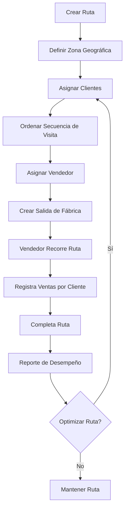

# Planificación de Rutas

El módulo de Planificación de Rutas de Fabrica Marie ERP permite organizar geográficamente los clientes en rutas de distribución, optimizando las visitas de los vendedores y facilitando la cobertura territorial.

## Concepto de Ruta

### ¿Qué es una Ruta?

Una ruta es una **agrupación geográfica de clientes** que un vendedor visita de forma regular. Las rutas permiten:

- Organizar territorios de venta
- Optimizar tiempos de desplazamiento
- Asignar responsabilidades comerciales
- Planificar despachos de productos
- Controlar cobertura geográfica

<Card title="Ejemplo de Ruta" icon="map" color="blue">
  ```
  Ruta: Ruta Norte - Zona 1
  Código: RN-Z1
  Zona: Municipio de Mixco
  Descripción: Tiendas y distribuidores del sector norte
  Clientes asignados: 24 clientes
  Estado: ACTIVA
  ```
</Card>

## Creación de Rutas

### Información Requerida

Para crear una ruta:

<CardGroup cols={2}>
  <Card title="Datos Básicos" icon="info-circle">
    - **Código**: Identificador único (ej: RN-Z1, RS-Z2)
    - **Nombre**: Descripción de la ruta
    - **Zona**: Área geográfica que cubre
    - **Descripción**: Detalles adicionales
  </Card>
  
  <Card title="Estado" icon="toggle-on">
    - **ACTIVA**: Ruta operativa
    - **INACTIVA**: Ruta temporal o permanentemente deshabilitada
  </Card>
</CardGroup>

### Ejemplo de Creación

```json
{
  "codigo": "RN-Z1",
  "nombre": "Ruta Norte - Zona 1",
  "zona": "Mixco, Zona 1",
  "descripcion": "Tiendas del mercado central y alrededores",
  "estado": "ACTIVA"
}
```

<Note>
  El código de la ruta debe ser único en el sistema. Se recomienda usar nomenclatura clara que identifique la zona geográfica.
</Note>

## Asignación de Clientes

### Asignar Clientes a una Ruta

Los clientes se asignan a rutas mediante una relación **muchos a muchos**, lo que permite que:

- Un cliente puede estar en **múltiples rutas** (si es visitado por diferentes vendedores)
- Una ruta contiene **múltiples clientes**
- Cada asignación tiene un **orden de visita**

### Orden de Visita

El campo `orden` en la tabla pivot define la secuencia en que el vendedor debe visitar los clientes:

```
Ruta: Ruta Norte - Zona 1

1. Tienda San José (orden: 1)
2. Distribuidora El Pacífico (orden: 2)
3. Supermercado La Esperanza (orden: 3)
4. Tienda Don Pedro (orden: 4)
...
```

<Tip>
  Ordena los clientes según la ubicación geográfica para minimizar distancias de recorrido y tiempo de viaje.
</Tip>

### Endpoint de Asignación

Para asignar múltiples clientes a una ruta:

```javascript
POST /api/rutas/{ruta_id}/asignar-clientes

{
  "clientes": [
    { "cliente_id": 15, "orden": 1 },
    { "cliente_id": 23, "orden": 2 },
    { "cliente_id": 8, "orden": 3 }
  ]
}
```

El sistema utiliza el método `sync()` de Laravel, lo que significa:
- Se eliminan las asignaciones previas
- Se crean las nuevas asignaciones con el orden especificado
- Es una operación de reemplazo completo

## Consulta de Rutas

### Listado de Rutas

Al consultar todas las rutas, el sistema devuelve:

<CardGroup cols={2}>
  <Card title="Información de la Ruta" icon="route">
    - Código y nombre
    - Zona geográfica
    - Descripción
    - Estado (activa/inactiva)
  </Card>
  
  <Card title="Clientes Asignados" icon="users">
    - Cantidad de clientes (`clientes_count`)
    - Lista completa de clientes
    - Orden de visita de cada cliente
  </Card>
</CardGroup>

### Vista Detallada de Ruta

```json
{
  "id": 5,
  "codigo": "RN-Z1",
  "nombre": "Ruta Norte - Zona 1",
  "zona": "Mixco",
  "descripcion": "Tiendas del mercado central",
  "estado": "ACTIVA",
  "clientes_count": 24,
  "clientes": [
    {
      "id": 15,
      "codigo_cliente": "CLI-0015",
      "razon_social": "Tienda San José",
      "direccion": "Calle Principal, Zona 1",
      "telefono": "2234-5678",
      "pivot": {
        "orden": 1
      }
    },
    {
      "id": 23,
      "codigo_cliente": "CLI-0023",
      "razon_social": "Distribuidora El Pacífico",
      "direccion": "Avenida Norte, Zona 1",
      "telefono": "2234-9012",
      "pivot": {
        "orden": 2
      }
    }
  ]
}
```

## Relación con Salidas de Fábrica

### Rutas en Salidas

Cuando se crea una **salida de fábrica** (despacho a vendedor), se debe especificar:

- **Vendedor** que realizará la ruta
- **Vehículo** asignado
- **Ruta** que va a recorrer
- **Zona** específica de la ruta

<Card title="Integración con Salidas" icon="truck-fast">
  Al crear una salida, el sistema asocia los productos despachados con la ruta que el vendedor va a recorrer, permitiendo:
  
  - Rastrear qué inventario está en qué ruta
  - Verificar cobertura de productos por zona
  - Generar reportes de ventas por ruta
</Card>

### Ejemplo de Salida con Ruta

```json
{
  "fecha": "2026-03-11",
  "vendedor_id": 7,
  "vehiculo_id": 3,
  "ruta_id": 5,
  "zona": "Mixco - Zona 1",
  "items": [
    { "producto_id": 12, "ruma_id": 2, "cantidad": 50 },
    { "producto_id": 18, "ruma_id": 2, "cantidad": 30 }
  ]
}
```

## Ventas Basadas en Rutas

### Clientes de la Ruta

Cuando un vendedor está en ruta, generalmente:

1. **Consulta la ruta** asignada
2. **Ve la lista de clientes** en orden de visita
3. **Visita cada cliente** según el orden
4. **Registra ventas** a medida que avanza
5. **Completa la ruta** al finalizar

<Tip>
  Los sistemas móviles de ventas pueden mostrar a los vendedores solo los clientes de su ruta activa, facilitando la navegación y el proceso de venta.
</Tip>

## Edición de Rutas

### Actualizar Información

Los administradores pueden editar:

- Nombre y descripción de la ruta
- Zona geográfica
- Estado (activar/desactivar)
- Asignación de clientes
- Orden de visita

<Note>
  Cambiar el estado a INACTIVA no elimina la ruta ni sus clientes, solo la deshabilita temporalmente. Puede reactivarse en cualquier momento.
</Note>

### Reasignación de Clientes

Si un cliente cambia de ubicación o se reorganizan territorios:

1. Quitar el cliente de la ruta actual
2. Asignarlo a la nueva ruta correspondiente
3. Definir nuevo orden de visita

<Warning>
  Al reasignar clientes entre rutas, asegúrate de actualizar también al vendedor responsable si aplica.
</Warning>

## Desactivación de Rutas

### Proceso de Desactivación

Para desactivar una ruta:

```javascript
DELETE /api/rutas/{id}

// El sistema ejecuta:
ruta.activo = false
ruta.save()
```

<Note>
  La desactivación es un "soft delete" funcional. La ruta permanece en la base de datos pero no aparece en listados activos.
</Note>

### Cuándo Desactivar una Ruta

- Reestructuración territorial
- Cierre temporal de zona
- Fusión de rutas
- Cambio de estrategia comercial

## Reportes de Rutas

### Reportes Disponibles

<CardGroup cols={2}>
  <Card title="Cobertura por Ruta" icon="map-location-dot">
    - Clientes por ruta
    - Ventas totales por ruta
    - Frecuencia de visitas
    - Clientes activos vs. inactivos
  </Card>
  
  <Card title="Desempeño de Vendedor por Ruta" icon="chart-line">
    - Ventas realizadas en cada ruta
    - Cumplimiento de cobertura (% de clientes visitados)
    - Productos más vendidos por ruta
  </Card>
  
  <Card title="Eficiencia de Ruta" icon="gauge-high">
    - Tiempo promedio de recorrido
    - Ventas por hora en ruta
    - Clientes visitados vs. planeados
  </Card>
  
  <Card title="Análisis Territorial" icon="globe">
    - Zonas con mayor/menor desempeño
    - Oportunidades de expansión
    - Rutas con baja cobertura
  </Card>
</CardGroup>

## Optimización de Rutas

### Mejores Prácticas

<CardGroup cols={2}>
  <Card title="Agrupar por Proximidad" icon="location-dot">
    Asigna clientes cercanos entre sí a la misma ruta para reducir tiempos de desplazamiento.
  </Card>
  
  <Card title="Balancear Carga" icon="scale-balanced">
    Distribuye clientes equitativamente entre rutas para evitar sobrecargar a un vendedor.
  </Card>
  
  <Card title="Considerar Volumen" icon="boxes-stacked">
    Rutas con clientes de alto volumen pueden requerir más tiempo y capacidad de vehículo.
  </Card>
  
  <Card title="Revisar Periódicamente" icon="calendar-check">
    Evalúa trimestralmente la efectividad de las rutas y ajusta según cambios en el mercado.
  </Card>
</CardGroup>

## Permisos y Roles

### ¿Quién puede acceder?

- **Administrador**: Crear, editar y desactivar rutas, asignar clientes
- **Gerente de Ventas**: Ver todas las rutas, asignar clientes, generar reportes
- **Coordinador de Rutas**: Gestionar asignación de clientes y orden de visita
- **Vendedor**: Ver solo sus rutas asignadas (lectura)
- **Despachador**: Consultar rutas para preparar salidas de fábrica

<Tip>
  Los vendedores no deben poder editar las rutas, pero sí sugerir cambios al coordinador basándose en su experiencia en campo.
</Tip>

## Integración con Otros Módulos

El módulo de rutas se integra con:

- **Clientes**: Cada cliente está asignado a una o más rutas
- **Salidas de Fábrica**: Las salidas especifican qué ruta recorrerá el vendedor
- **Ventas**: Las ventas se asocian indirectamente a rutas vía el vendedor
- **Seguimiento GPS**: Las rutas pueden compararse con recorridos reales GPS
- **Viáticos**: Los viáticos se aprueban según la ruta a recorrer

---

## Flujo de Trabajo Típico



<Note>
  Las rutas son elementos clave para la organización territorial. Una buena planificación de rutas mejora la eficiencia operativa, reduce costos de transporte y aumenta la cobertura de mercado.
</Note>