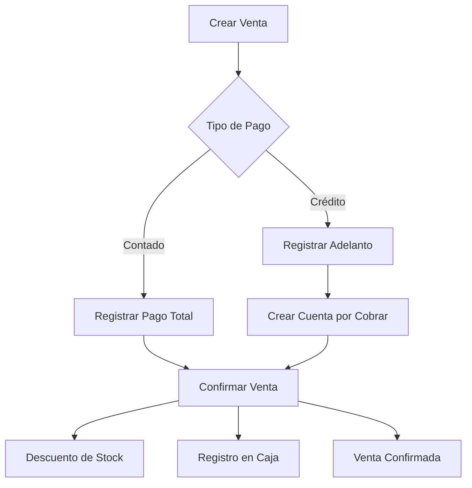

# Gestión de Ventas

El módulo de Gestión de Ventas de Fabrica Marie ERP permite registrar, confirmar y administrar todas las transacciones comerciales, desde ventas de contado hasta ventas a crédito con seguimiento de cuentas por cobrar.

## Proceso de Venta

### Flujo Completo de una Venta

<Steps>
  <Step title="Crear Venta (Borrador)">
    El vendedor o administrador crea una nueva venta seleccionando cliente, productos y forma de pago. La venta se guarda en estado **BORRADOR**.
  </Step>
  
  <Step title="Reserva de Stock">
    Automáticamente se reserva el stock del vendedor para los productos seleccionados, evitando sobreventa.
  </Step>
  
  <Step title="Confirmar Venta">
    Al confirmar, el sistema valida el stock, descuenta del inventario del vendedor y registra el ingreso en caja.
  </Step>
  
  <Step title="Generación de Código">
    Se asigna un código único (ej: VTA-000001) para rastrear la transacción.
  </Step>
</Steps>

<Note>
  Las ventas en **BORRADOR** pueden editarse o eliminarse. Una vez **CONFIRMADAS**, solo pueden anularse con permisos especiales.
</Note>

## Tipos de Pago

### Venta de Contado

<Card title="Contado" icon="money-bill-wave" color="green">
  El cliente paga el monto total al momento de la venta.
  
  **Características:**
  - Pago completo inmediato
  - Múltiples métodos: efectivo, transferencia, tarjeta
  - Registro automático en caja como INGRESO
  - No genera cuenta por cobrar
</Card>

**Métodos de pago disponibles:**
- Efectivo
- Transferencia bancaria
- Tarjeta de crédito/débito
- Depósito
- Cheque

### Venta a Crédito

<Card title="Crédito" icon="credit-card" color="orange">
  El cliente puede pagar el monto total en una fecha futura o mediante abonos parciales.
  
  **Características:**
  - Adelanto opcional al momento de la venta
  - Genera automáticamente una **Cuenta por Cobrar**
  - Saldo pendiente = Total - Adelanto
  - Estado: PENDIENTE, PARCIAL, PAGADO
</Card>

#### Ejemplo de Venta a Crédito

```
Total de la venta: Q1,500.00
Adelanto pagado:    Q  500.00
---------------------------------
Saldo pendiente:   Q1,000.00

Estado: PENDIENTE
```

<Tip>
  El adelanto se registra en caja inmediatamente. Los abonos posteriores se gestionan desde el módulo de **Gestión de Clientes**.
</Tip>

## Creación de Ventas

### Información Requerida

<CardGroup cols={2}>
  <Card title="Datos del Cliente" icon="user">
    - Seleccionar cliente existente
    - El sistema valida límite de crédito
    - Verifica condición de pago permitida
  </Card>
  
  <Card title="Datos del Vendedor" icon="id-badge">
    - Vendedor responsable de la transacción
    - Debe tener stock disponible de los productos
    - Asociado a una salida activa (EN_RUTA)
  </Card>
</CardGroup>

### Agregar Productos

Para cada producto en la venta:

- **Producto**: Seleccionar del stock del vendedor
- **Salida asociada**: La salida de fábrica de donde proviene el producto
- **Cantidad**: Unidades a vender (valida disponibilidad)
- **Precio unitario**: Se sugiere el precio base, pero es editable
- **Subtotal**: Cantidad × Precio unitario
- **Bonificación**: Marcar si es producto gratis
- **Degustación**: Marcar si es muestra sin cargo

<Note>
  Los productos marcados como bonificación o degustación no se cobran, pero sí descuentan del stock del vendedor.
</Note>

### Descuentos y Totales

```
Subtotal (suma items):    Q1,800.00
Descuento aplicado:       Q  100.00
---------------------------------
Total Neto:              Q1,700.00
```

## Confirmación de Ventas

### Validaciones al Confirmar

Antes de confirmar una venta, el sistema verifica:

<CardGroup cols={2}>
  <Card title="Stock Suficiente" icon="boxes-stacked">
    Valida que el vendedor tenga stock disponible (no reservado ni vendido) de cada producto.
  </Card>
  
  <Card title="Estado de Venta" icon="circle-check">
    Solo se pueden confirmar ventas en estado BORRADOR.
  </Card>
  
  <Card title="Caja Abierta" icon="cash-register">
    El usuario debe tener una caja abierta para registrar el ingreso.
  </Card>
  
  <Card title="Permisos" icon="lock">
    Usuarios con permiso `stock.negativo` pueden vender sin stock disponible (casos especiales).
  </Card>
</CardGroup>

### Acciones al Confirmar

Cuando se confirma una venta:

1. **Libera la reserva** del stock del vendedor
2. **Descuenta la cantidad vendida** del inventario móvil del vendedor
3. **Actualiza la salida** disminuyendo las cantidades disponibles
4. **Registra en caja**:
   - Venta de contado: registra el total neto
   - Venta a crédito: registra solo el adelanto
5. **Cambia el estado** a CONFIRMADA
6. **Crea cuenta por cobrar** si es a crédito

<Tip>
  Una vez confirmada, una venta no puede editarse. Solo puede anularse, lo cual revierte todos los movimientos.
</Tip>

## Edición y Eliminación

### Editar Venta en Borrador

Mientras la venta esté en estado BORRADOR:
- Cambiar cliente
- Modificar productos y cantidades
- Cambiar tipo de pago
- Ajustar descuentos

El sistema elimina los items anteriores y recalcula el total automáticamente.

### Eliminar Venta en Borrador

<Warning>
  Al eliminar una venta en borrador:
  - Se liberan las reservas de stock
  - Se eliminan todos los items
  - La venta se borra permanentemente
  
  Esta acción no se puede deshacer.
</Warning>

## Anulación de Ventas

### Proceso de Anulación

Para ventas CONFIRMADAS que necesitan reversarse:

1. Solo usuarios con permisos especiales pueden anular
2. Se reversa el movimiento de caja
3. Se devuelve el stock al vendedor
4. Si es crédito, se elimina o ajusta la cuenta por cobrar
5. La venta queda marcada como ANULADA

<Note>
  Las anulaciones mantienen el registro histórico para auditoría, pero revierten todos los efectos en inventario y caja.
</Note>

## Reportes de Ventas

### Filtros Disponibles

Los reportes de ventas permiten filtrar por:

<CardGroup cols={3}>
  <Card title="Fechas" icon="calendar-days">
    - Fecha desde
    - Fecha hasta
    - Rango personalizado
  </Card>
  
  <Card title="Cliente" icon="user">
    Ver ventas de un cliente específico
  </Card>
  
  <Card title="Vendedor" icon="user-tie">
    Desempeño individual de cada vendedor
  </Card>
  
  <Card title="Producto" icon="box">
    Ventas de un producto específico
  </Card>
  
  <Card title="Tipo de Pago" icon="money-bill">
    - Contado
    - Crédito
    - Todos
  </Card>
  
  <Card title="Estado" icon="toggle-on">
    - Borrador
    - Confirmada
    - Anulada
  </Card>
</CardGroup>

### Resumen Ejecutivo

Cada reporte incluye un resumen con:

```
Cantidad de ventas:       42 transacciones
Total vendido:           Q45,200.00
Total contado:           Q32,500.00 (72%)
Total crédito:           Q12,700.00 (28%)
```

### Exportación a Excel

<Card title="Exportar Reporte" icon="file-excel" color="green">
  Los reportes se pueden exportar a formato Excel (.xls) con:
  - Todas las ventas del período
  - Desglose de productos por venta
  - Totales por tipo de pago
  - Información de cliente y vendedor
</Card>

## Historial de Ventas

### Vista Detallada de Venta

Al consultar una venta específica, se muestra:

<CardGroup cols={2}>
  <Card title="Información General" icon="file-invoice">
    - Código de venta
    - Fecha y hora
    - Cliente y vendedor
    - Tipo y método de pago
    - Total neto
    - Estado actual
  </Card>
  
  <Card title="Detalle de Items" icon="list">
    - Productos vendidos
    - Cantidades
    - Precios unitarios
    - Subtotales
    - Bonificaciones
  </Card>
  
  <Card title="Movimientos Relacionados" icon="exchange">
    - Movimientos de stock
    - Movimientos de caja
    - Salida de origen
  </Card>
  
  <Card title="Cuenta por Cobrar" icon="credit-card">
    - Monto total de deuda
    - Saldo pendiente
    - Historial de abonos
    - Estado de pago
  </Card>
</CardGroup>

## Permisos y Roles

### ¿Quién puede acceder?

- **Administrador**: Acceso completo, puede anular ventas
- **Gerente de Ventas**: Crear, confirmar, ver reportes y anular
- **Vendedor**: Crear ventas de sus propios clientes en su ruta
- **Cajero**: Ver ventas para conciliar con caja

<Tip>
  El permiso especial `stock.negativo` permite confirmar ventas aunque no haya stock suficiente, útil para preventa o casos autorizados.
</Tip>

## Integración con Otros Módulos

El módulo de ventas se integra con:

- **Inventario**: Descuenta automáticamente del stock del vendedor
- **Caja**: Registra ingresos de contado y adelantos de crédito
- **Gestión de Clientes**: Crea cuentas por cobrar y actualiza deuda del cliente
- **Rutas**: Asocia ventas a la ruta del vendedor
- **Reportes**: Genera estadísticas de desempeño comercial

---

## Flujo de Trabajo Típico



<Note>
  El sistema está diseñado para soportar ventas en ruta por vendedores móviles, con validaciones de stock en tiempo real y sincronización con el inventario central.
</Note>