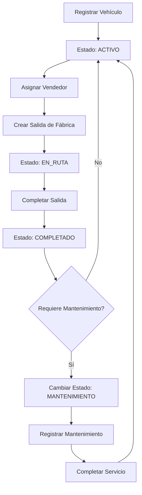

# Seguimiento de Vehículos

El módulo de Seguimiento de Vehículos de Fabrica Marie ERP permite administrar la flota vehicular de la empresa, controlando la asignación de vehículos a vendedores, el estado operativo y el historial de mantenimientos.

## Registro de Vehículos

### Información del Vehículo

Cada vehículo en el sistema contiene:

<CardGroup cols={2}>
  <Card title="Identificación" icon="id-card">
    - **Código**: Identificador único interno (ej: VEH-001)
    - **Placa**: Matrícula oficial del vehículo
    - **Marca**: Fabricante (Toyota, Ford, etc.)
    - **Modelo**: Línea específica (Hilux, Ranger, etc.)
    - **Año**: Año de fabricación
  </Card>
  
  <Card title="Características Técnicas" icon="gears">
    - **Tipo**: Camión, camioneta, panel, etc.
    - **Capacidad de Carga**: Peso máximo en kilogramos o toneladas
    - **Color**: Identificación visual
    - **VIN**: Número de identificación vehicular
    - **Estado**: ACTIVO, INACTIVO, MANTENIMIENTO
  </Card>
</CardGroup>

### Ejemplo de Registro

```json
{
  "codigo": "VEH-001",
  "placa": "P-123ABC",
  "marca": "Toyota",
  "modelo": "Hilux",
  "año": 2022,
  "tipo": "Camioneta",
  "capacidad_carga": 1200,
  "color": "Blanco",
  "vin": "JTMHK9AJ7H4000123",
  "estado": "ACTIVO"
}
```

<Note>
  La placa del vehículo debe ser única en el sistema para evitar duplicados.
</Note>

## Estados del Vehículo

<CardGroup cols={3}>
  <Card title="ACTIVO" icon="check-circle" color="green">
    Vehículo operativo y disponible para asignación a salidas de fábrica.
  </Card>
  
  <Card title="INACTIVO" icon="circle-xmark" color="gray">
    Vehículo fuera de servicio, no disponible temporalmente (ej: accidente, trámites).
  </Card>
  
  <Card title="MANTENIMIENTO" icon="wrench" color="orange">
    Vehículo en taller para mantenimiento preventivo o correctivo.
  </Card>
</CardGroup>

## Asignación de Vendedores

### Relación Vehículo-Vendedor

Los vehículos se asignan a vendedores mediante una relación **muchos a muchos**:

- Un vehículo puede ser usado por **múltiples vendedores** (en diferentes momentos)
- Un vendedor puede operar **múltiples vehículos** (según disponibilidad)

### Proceso de Asignación

<Steps>
  <Step title="Seleccionar Vehículo">
    Identificar el vehículo disponible (estado ACTIVO).
  </Step>
  
  <Step title="Seleccionar Vendedor">
    Especificar qué vendedor operará el vehículo.
  </Step>
  
  <Step title="Validar Duplicado">
    El sistema verifica que el vehículo no esté ya asignado a ese vendedor.
  </Step>
  
  <Step title="Crear Relación">
    Se guarda la asignación en la tabla pivot `vendedor_vehiculo`.
  </Step>
</Steps>

### Endpoint de Asignación

```javascript
POST /api/vehiculos/{vehiculo_id}/assign-vendedor

{
  "vendedor_id": 7
}
```

**Validación:**
- Si el vendedor ya tiene asignado ese vehículo, el sistema devuelve error 400
- La asignación no tiene fecha de expiración; es válida hasta que se desasigne

<Tip>
  La asignación de vehículos a vendedores también puede ocurrir **automáticamente** al crear una salida de fábrica. Si el vendedor no está asignado al vehículo, el sistema lo asigna al registrar la salida.
</Tip>

## Control en Salidas de Fábrica

### Restricción de Salidas Simultáneas

Para garantizar control operativo:

<Warning>
  Un vehículo **no puede** tener dos salidas activas (PENDIENTE o EN_RUTA) al mismo tiempo.
  
  Si se intenta crear una salida con un vehículo que ya está en otra salida activa, el sistema devuelve:
  
  ```json
  {
    "error": "El vehiculo ya tiene una salida pendiente o en ruta"
  }
  ```
</Warning>

### Estados de Salida

- **PENDIENTE**: La salida está programada pero el vehículo aún no ha salido
- **EN_RUTA**: El vehículo está en operación de distribución
- **COMPLETADO**: La ruta ha finalizado, el vehículo está disponible nuevamente

<Note>
  Solo cuando una salida cambia a estado COMPLETADO, el vehículo queda libre para una nueva asignación.
</Note>

## Integración con GPS

### Puntos GPS del Vehículo

Cada vehículo puede tener puntos GPS registrados que permiten:

- Rastrear ubicación en tiempo real
- Historial de recorridos
- Validar cumplimiento de rutas
- Analizar tiempos de desplazamiento

<Card title="Relación con GPS" icon="location-dot">
  La tabla `gps_points` almacena:
  - `vehiculo_id`: Vehículo rastreado
  - `latitude` / `longitude`: Coordenadas GPS
  - `captured_at`: Fecha y hora de captura
  - `speed`: Velocidad del vehículo (opcional)
  - `accuracy`: Precisión de la señal GPS
</Card>

## Gestión de Mantenimientos

### Registro de Mantenimientos

Cada vehículo tiene un historial de mantenimientos asociados:

<CardGroup cols={2}>
  <Card title="Tipos de Mantenimiento" icon="tools">
    - **Preventivo**: Revisiones programadas (cambio de aceite, filtros, frenos)
    - **Correctivo**: Reparaciones por fallas o averías
    - **Inspección**: Revisión técnica vehicular, verificación anual
  </Card>
  
  <Card title="Información del Mantenimiento" icon="clipboard">
    - Fecha programada vs. fecha realizada
    - Tipo de servicio
    - Descripción del trabajo realizado
    - Costo del mantenimiento
    - Taller o proveedor
    - Próximo mantenimiento
  </Card>
</CardGroup>

### Ejemplo de Mantenimiento

```json
{
  "vehiculo_id": 3,
  "tipo": "PREVENTIVO",
  "descripcion": "Cambio de aceite y filtros",
  "fecha_programada": "2026-03-15",
  "fecha_realizada": "2026-03-15",
  "costo": 450.00,
  "proveedor": "Taller Mecánico Central",
  "kilometraje": 45000,
  "proximo_mantenimiento": "2026-06-15"
}
```

### Consulta de Mantenimientos

Al consultar un vehículo, se incluye su historial de mantenimientos ordenado por fecha descendente:

```json
{
  "id": 3,
  "codigo": "VEH-001",
  "placa": "P-123ABC",
  "marca": "Toyota",
  "estado": "ACTIVO",
  "mantenimientos": [
    {
      "id": 15,
      "tipo": "PREVENTIVO",
      "descripcion": "Cambio de aceite y filtros",
      "fecha_realizada": "2026-03-15",
      "costo": 450.00
    },
    {
      "id": 12,
      "tipo": "CORRECTIVO",
      "descripcion": "Reparación de frenos",
      "fecha_realizada": "2026-02-10",
      "costo": 1200.00
    }
  ]
}
```

<Tip>
  Programa mantenimientos preventivos regulares para prolongar la vida útil de los vehículos y reducir costos de reparaciones mayores.
</Tip>

## Reportes de Vehículos

### Reportes Disponibles

<CardGroup cols={2}>
  <Card title="Flota Activa" icon="list-check">
    - Total de vehículos
    - Vehículos por estado (activo/inactivo/mantenimiento)
    - Vehículos disponibles para salida
    - Vehículos en ruta actualmente
  </Card>
  
  <Card title="Uso por Vehículo" icon="chart-line">
    - Número de salidas por vehículo
    - Kilómetros recorridos (si se registra)
    - Frecuencia de uso
    - Rendimiento operativo
  </Card>
  
  <Card title="Costos de Mantenimiento" icon="dollar-sign">
    - Costo total de mantenimiento por vehículo
    - Promedio de costo por tipo de servicio
    - Vehículos con mayor costo operativo
    - Proyección de gastos futuros
  </Card>
  
  <Card title="Historial de Asignaciones" icon="user-gear">
    - Vendedores asignados a cada vehículo
    - Frecuencia de uso por vendedor
    - Rotación de vehículos
  </Card>
</CardGroup>

## Desactivación de Vehículos

### Proceso de Desactivación

Para desactivar un vehículo:

```javascript
DELETE /api/vehiculos/{id}

// El sistema ejecuta:
vehiculo.activo = false
vehiculo.save()
```

<Warning>
  La desactivación es un "soft delete". El vehículo permanece en la base de datos con historial completo, pero no aparece en listados de vehículos activos.
</Warning>

### Cuándo Desactivar un Vehículo

- Vehículo vendido o dado de baja
- Siniestro total
- Fuera de servicio permanentemente
- Traspaso a otra sucursal

<Note>
  Antes de desactivar un vehículo, asegúrate de que no tenga salidas activas (PENDIENTE o EN_RUTA).
</Note>

## Alertas y Notificaciones

### Alertas Recomendadas

<CardGroup cols={2}>
  <Card title="Mantenimiento Próximo" icon="bell">
    Notificar cuando un vehículo está cerca de su fecha de mantenimiento programado.
  </Card>
  
  <Card title="Vehículo sin Uso" icon="clock">
    Alertar si un vehículo activo no ha tenido salidas en X días.
  </Card>
  
  <Card title="Costos Elevados" icon="triangle-exclamation">
    Notificar si un vehículo supera el presupuesto de mantenimiento mensual.
  </Card>
  
  <Card title="Documentos Vencidos" icon="file-circle-xmark">
    Alertar sobre vencimiento de seguros, revisión técnica, etc.
  </Card>
</CardGroup>

## Permisos y Roles

### ¿Quién puede acceder?

- **Administrador**: Acceso completo, gestión de vehículos y asignaciones
- **Gerente de Flota**: Administrar vehículos, mantenimientos y reportes
- **Coordinador de Rutas**: Asignar vehículos a salidas de fábrica
- **Mecánico**: Registrar mantenimientos realizados
- **Vendedor**: Ver solo los vehículos asignados a él (lectura)

<Tip>
  Los vendedores deben reportar cualquier problema mecánico inmediatamente para programar mantenimiento correctivo.
</Tip>

## Integración con Otros Módulos

El módulo de vehículos se integra con:

- **Salidas de Fábrica**: Los vehículos transportan inventario a los vendedores
- **Seguimiento GPS**: Rastreo en tiempo real de ubicación y recorridos
- **Rutas**: Los vehículos se asignan según la capacidad requerida para la ruta
- **Recursos Humanos**: Viáticos y gastos de combustible asociados al vehículo
- **Reportes**: Análisis de eficiencia operativa de la flota

---

## Flujo de Trabajo Típico



<Note>
  El seguimiento de vehículos es esencial para optimizar costos operativos, garantizar disponibilidad de flota y mantener la eficiencia en la distribución.
</Note>